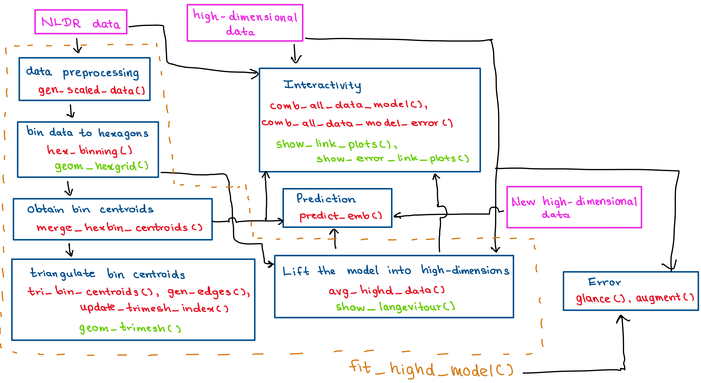

```{r setup, include=FALSE}
options(repos = "https://cloud.r-project.org") ## set up CRAN mirror
knitr::opts_chunk$set(
  echo = FALSE, 
  cache=FALSE, 
  message=FALSE, 
  warning=FALSE,
  comment = ">",
  out.width = "100%",
  htmlwidgets.sizing = TRUE)

```

```{r install-libraries, include=FALSE, warning=FALSE, echo=FALSE, eval=FALSE}

# Ensure remotes is available
if (!requireNamespace("remotes", quietly = TRUE)) {
  install.packages("remotes")
}

# Read the package list
pkgs_raw <- readLines("_Rpackages.txt")
pkgs_raw <- pkgs_raw[nzchar(pkgs_raw)]  # remove empty lines

# Split into package and version
parts <- strsplit(pkgs_raw, "==")
pkgs <- vapply(parts, `[[`, "", 1)
versions <- vapply(parts, `[[`, "", 2)

# Install packages with exact versions
for (i in seq_along(pkgs)) {
  pkg <- pkgs[i]
  ver <- versions[i]

  if (!requireNamespace(pkg, quietly = TRUE) ||
      as.character(packageVersion(pkg)) != ver) {

    message(sprintf("Installing %s (%s)", pkg, ver))
    remotes::install_version(pkg, version = ver, upgrade = "never")
  }
}

```

```{r load-libraries}
library(quollr)
library(tibble)
library(knitr)
library(kableExtra)
library(ggplot2)
library(dplyr)
library(patchwork)
library(readr)
library(plotly)
library(crosstalk)
library(htmltools)
library(detourr)

set.seed(20240110)
```

```{r plot-theme}
theme_set(theme_linedraw() +
   theme(
     aspect.ratio = 1,
     plot.background = element_rect(fill = 'transparent', colour = NA),
     plot.title = element_text(size = 7, hjust = 0.5, vjust = -0.5),
     panel.background = element_rect(fill = 'transparent', 
                                     colour = NA),
     panel.grid.major = element_blank(), 
     panel.grid.minor = element_blank(), 
     axis.title.x = element_blank(), axis.title.y = element_blank(),
     axis.text.x = element_blank(), axis.ticks.x = element_blank(),
     axis.text.y = element_blank(), axis.ticks.y = element_blank(),
     legend.background = element_rect(fill = 'transparent', 
                                      colour = NA),
     legend.key = element_rect(fill = 'transparent', 
                               colour = NA),
     legend.position = "none", 
     legend.title = element_text(size=5), 
     legend.text = element_text(size=4),
     legend.key.height = unit(0.25, 'cm'),
     legend.key.width = unit(0.25, 'cm'),
     plot.margin = margin(0, 0, 0, 0)
   )

)
```

```{r}
#| label: import-scripts
source("scripts/additional_functions.R")
```

<!-- 20 pages-->

# Introduction

<!-- research gap: add about hexbin pkg, and emphasize that in our package provide regular hexagons-->
<!-- objective: introduce a new tool to help to determine which method, which parameter choice provide the most useful representation of high-D data.--> 
<!--intro with S-curve with 5 methods-->

Nonlinear dimension reduction (NLDR) techniques, such as t-distributed stochastic neighbor embedding (tSNE) [@laurens2008], uniform manifold approximation and projection (UMAP) [@leland2018], potential of heat-diffusion for affinity-based trajectory embedding (PHATE) algorithm [@moon2019], large-scale dimensionality reduction Using triplets (TriMAP) [@amid2019], and pairwise controlled manifold approximation (PaCMAP) [@yingfan2021], can create hugely different representations depending on the selected method and hyper-parameter choices. It is difficult to determine whether any of these representations are accurate, which one is the best, or whether they have missed important structures. 

This paper presents the R package, `quollr`, which is useful for understanding how NLDR warps high-dimensional space and fits the data. Starting with an NLDR layout, our approach is to create a $2\text{-}D$ wireframe model representation, that can be lifted and displayed in the high-dimensional ($p\text{-}D$) space (`r knitr::asis_output(if (knitr::is_html_output()) { "Figure \\@ref(fig:overviewhtml)"} else { "Figure \\@ref(fig:overview)"})`).

```{r}
clr_choice <- "#66B2CC"

scurve_model_obj <- fit_highd_model(
  highd_data = scurve, 
  nldr_data = scurve_umap, 
  b1 = 21, 
  q = 0.1, 
  hd_thresh = 0)

scurve_umap_scaled <- scurve_model_obj$nldr_scaled_obj$scaled_nldr
tr_from_to_df_scurve <- scurve_model_obj$trimesh_data
df_bin_centroids_scurve <- scurve_model_obj$model_2d
df_bin_scurve <- scurve_model_obj$model_highd
hex_grid_scurve <- scurve_model_obj$hb_obj$hex_poly
counts_df_scurve <- scurve_model_obj$hb_obj$std_cts

hex_grid_with_counts_scurve <- left_join(
  hex_grid_scurve, counts_df_scurve, 
  by = c("h" = "h"))

hex_grid_nonempty_scurve <- hex_grid_scurve |>
  filter(h %in% df_bin_centroids_scurve$h)

sc_xlims <- c(-0.25, 1.35)
sc_ylims <- c(-0.25, 1.35)

scurve_umap_plt <- ggplot(
  scurve_umap_scaled, 
  aes(x = emb1, y = emb2)) +
  geom_point(alpha = 0.5, color = clr_choice, size = 0.5) +
  interior_annotation("a", cex = 1) +
  xlim(sc_xlims) +
  ylim(sc_ylims)

scurve_umap_plt_int <- ggplotly(scurve_umap_plt, 
                                width = "350", 
                                height = "350", 
                                tooltip = "none") |>
  config(
    staticPlot = TRUE,        # Disables all interactivity (no hover, zoom, pan)
    displayModeBar = FALSE,   # Hides the plotly toolbar
    editable = FALSE,         # Disables annotations and editing
    showTips = FALSE,         # Removes tooltip on hover
    displaylogo = FALSE,      # Hides plotly logo
    responsive = FALSE        # Disables responsive resizing
  )

hex_grid_poly_scurve <- ggplot(
  data = hex_grid_with_counts_scurve, 
  aes(x = x, y = y)) +
  geom_polygon(color = "grey70", 
               aes(group = h), 
               fill = "#ffffff") +
  geom_point(data = scurve_umap_scaled, 
             aes(x = emb1, y = emb2), 
             alpha = 0.8, size = 0.5, color = clr_choice) + 
  interior_annotation("a", cex = 1) +
  xlim(sc_xlims) +
  ylim(sc_ylims)

hex_grid_poly_scurve_int <- ggplotly(hex_grid_poly_scurve, 
                                width = "400", 
                                height = "380", 
                                tooltip = "none") |>
  config(
    staticPlot = TRUE,        # Disables all interactivity (no hover, zoom, pan)
    displayModeBar = FALSE,   # Hides the plotly toolbar
    editable = FALSE,         # Disables annotations and editing
    showTips = FALSE,         # Removes tooltip on hover
    displaylogo = FALSE,      # Hides plotly logo
    responsive = FALSE        # Disables responsive resizing
  )

hex_centroids_scurve <- ggplot(
  data = hex_grid_with_counts_scurve, 
  aes(x = x, y = y)) +
  geom_polygon(color = "grey70", 
               aes(group = h), 
               fill = "#ffffff")  +
  geom_point(data = df_bin_centroids_scurve, 
             aes(x = c_x, y = c_y), 
             size = 1, color = "#FF7755") +
  interior_annotation("b", cex = 1) +
  xlim(sc_xlims) +
  ylim(sc_ylims)

hex_centroids_scurve_int <- ggplotly(hex_centroids_scurve, 
                                width = "400", 
                                height = "380", 
                                tooltip = "none") |>
  config(
    staticPlot = TRUE,        # Disables all interactivity (no hover, zoom, pan)
    displayModeBar = FALSE,   # Hides the plotly toolbar
    editable = FALSE,         # Disables annotations and editing
    showTips = FALSE,         # Removes tooltip on hover
    displaylogo = FALSE,      # Hides plotly logo
    responsive = FALSE        # Disables responsive resizing
  )

wireframe_scurve <- ggplot() +
  geom_segment(data = tr_from_to_df_scurve,
               aes(
                 x = x_from,
                 y = y_from,
                 xend = x_to,
                 yend = y_to),
               colour = "#000000") +
  geom_point(data = df_bin_centroids_scurve, 
             aes(x = c_x, y = c_y), 
             size = 1, color = "#FF7755") +
  interior_annotation("c", cex = 1) +
  xlim(sc_xlims) +
  ylim(sc_ylims)

wireframe_scurve_int <- ggplotly(wireframe_scurve, 
                                width = "350", 
                                height = "320", 
                                tooltip = "none") |>
  config(
    staticPlot = TRUE,        # Disables all interactivity (no hover, zoom, pan)
    displayModeBar = FALSE,   # Hides the plotly toolbar
    editable = FALSE,         # Disables annotations and editing
    showTips = FALSE,         # Removes tooltip on hover
    displaylogo = FALSE,      # Hides plotly logo
    responsive = FALSE        # Disables responsive resizing
  )

## 2-d vis model
hex_grid_scurve <- ggplot(
  data = hex_grid_with_counts_scurve, 
  aes(x = x, y = y)) +
  geom_point(data = scurve_umap_scaled, 
             aes(x = emb1, y = emb2), 
             size = 0.5, color = clr_choice) +
  geom_segment(data = tr_from_to_df_scurve,
               aes(
                 x = x_from,
                 y = y_from,
                 xend = x_to,
                 yend = y_to),
               colour = "#000000") +
  geom_point(data = df_bin_centroids_scurve, 
             aes(x = c_x, y = c_y), 
             size = 1, color = "#FF7755")

hex_grid_scurve_int <- ggplotly(hex_grid_scurve, 
                                width = "350", 
                                height = "380", 
                                tooltip = "none") |>
  config(
    staticPlot = TRUE,        # Disables all interactivity (no hover, zoom, pan)
    displayModeBar = FALSE,   # Hides the plotly toolbar
    editable = FALSE,         # Disables annotations and editing
    showTips = FALSE,         # Removes tooltip on hover
    displaylogo = FALSE,      # Hides plotly logo
    responsive = FALSE        # Disables responsive resizing
  )


## High-d vis model
df_exe <- comb_data_model(
    highd_data = scurve, 
    model_highd = df_bin_scurve, 
    model_2d = df_bin_centroids_scurve
)

df <- df_exe |>
    dplyr::filter(type == "data") ## original dataset

df_b <- df_exe |>
  dplyr::filter(type == "model") ## High-d model

scurve_umap_model_vis <- langevitour::langevitour(df_exe[1:(length(df_exe)-1)],
                         lineFrom = tr_from_to_df_scurve$from_reindexed,
                         lineTo = tr_from_to_df_scurve$to_reindexed,
                         group = df_exe$type,
                         pointSize = append(rep(2, NROW(df_b)), rep(1, NROW(df))),
                         levelColors = c(clr_choice, "#FF7755"),
                         enableControls = FALSE,
                         width = "400px", height = "380px")

scurve_umap_model_vis_n <- langevitour::langevitour(df_exe[1:(length(df_exe)-1)],
                         lineFrom = tr_from_to_df_scurve$from_reindexed,
                         lineTo = tr_from_to_df_scurve$to_reindexed,
                         group = df_exe$type,
                         pointSize = append(rep(2, NROW(df_b)), rep(1, NROW(df))),
                         levelColors = c(clr_choice, "#FF7755"),
                         enableControls = FALSE,
                         width = "400px", height = "380px")

```

```{r overviewhtml, eval=knitr::is_html_output(), fig.cap="Wireframe model representation of the NLDR layout, lifted and displayed in high-dimensional space. The left panel shows the NLDR layout with a triangular mesh overlay, forming the wireframe structure. This mesh can be lifted into higher dimensions and projected to examine how the geometric structure of the data is preserved. Panels (a1–a4) display different $2\\text{-}D$ projections of the lifted wireframe, where the underlying curved sheet structure of the data is more clearly visible. The triangulated mesh highlights how local neighborhoods in the layout correspond to relationships in the high-dimensional space, enabling diagnostics of distortion and preservation across dimensions.", fig.pos="!ht", layout = "l-body", fig.alt="The UMAP layout with a triangular mesh on the left and 2-D projections of the lifted wireframe overlaying the data on the right. The mesh illustrates how local neighborhoods in the 2-D embedding correspond to curved sheet structures in the original high-dimensional S-curve data."}

overviewfig <- bscols(
  htmltools::div(
    style = "
      display: flex;
      justify-content: center;  /* centers the whole grid */
      margin: 0 auto;
      padding: 0;
    ",
    htmltools::div(
      style = "
        display: grid;
        grid-template-columns: 1fr 1fr;
        gap: 0px;
        align-items: start;
        justify-items: center;
        margin: 0;
        padding: 0;
      ",
      htmltools::div(style = "margin: 0; padding: 0;", hex_grid_scurve_int),
      htmltools::div(style = "margin: 0; margin-top: 13px; padding: 0;", scurve_umap_model_vis)
    )
  ),
  device = "xs"
)

# Ensure it's treated as a widget
class(overviewfig) <- c(class(overviewfig), "htmlwidget")

overviewfig
```

```{r scurve-projections}

df_b_scurve <- df_bin_scurve |>
  dplyr::filter(h %in% df_bin_centroids_scurve$h) |>
  dplyr::mutate(type = "model") ## Data with summarized mean

## Reorder the rows of df_b according to the h order in df_b_with_center_data
df_b_scurve <- df_b_scurve[match(df_bin_centroids_scurve$h, df_b_scurve$h),] |>
  dplyr::select(-h) 

scurve_labeled <- scurve |>
  select(-ID) |>
  mutate(type = "data")

# Apply the scaling
df_model_data_scurve <- bind_rows(scurve_labeled, df_b_scurve)
scaled_scurve <- scale_data_manual(df_model_data_scurve, "type") |>
  as_tibble()

scaled_scurve_data <- scaled_scurve |>
  filter(type == "data") |>
  select(-type)

scaled_scurve_data_model <- scaled_scurve |>
  filter(type == "model") |>
  select(-type)


## First projection
projection <- cbind(
  c(0.10479,0.06673,0.19430,-0.14763,0.02861,-0.04302,0.06601),
  c(0.11421,0.18556,-0.16860,-0.05033,-0.00219,0.04159,0.04285))

proj_obj1 <- get_projection(projection = projection, 
                            proj_scale = 1.23, 
                            highd_data = scaled_scurve_data, 
                            model_highd = scaled_scurve_data_model, 
                            trimesh_data = tr_from_to_df_scurve, 
                            axis_param = list(limits = 0.5, 
                                              axis_scaled = 2,
                                              axis_pos_x = -0.25, 
                                              axis_pos_y = -0.25, 
                                              threshold = 0.0259))

scurve_proj_umap_model1 <- plot_proj(
  proj_obj = proj_obj1,
  point_param = c(0.5, 0.2, clr_choice), # size, alpha, color
  plot_limits = c(-0.35, 0.35), 
  axis_text_size = 2,
  is_category = FALSE) +
  interior_annotation(label = "a1", cex = 1)

scurve_proj_umap_model1_dp <- plot_proj(
  proj_obj = proj_obj1,
  point_param = c(0.2, 0, clr_choice), # size, alpha, color
  plot_limits = c(-0.35, 0.35), 
  axis_text_size = 3,
  is_category = FALSE) +
  interior_annotation(label = "d", cex = 1)

## Second projection

projection <- cbind(
  c(0.01588,-0.13640,-0.17180,-0.15486,-0.09726,0.00858,0.01090),
  c(0.21443,-0.00390,0.08182,-0.11746,0.06820,-0.05458,-0.08885))

proj_obj2 <- get_projection(projection = projection, 
                            proj_scale = 1.23, 
                            highd_data = scaled_scurve_data, 
                            model_highd = scaled_scurve_data_model, 
                            trimesh_data = tr_from_to_df_scurve, 
                            axis_param = list(limits = 0.5, 
                                              axis_scaled = 2,
                                              axis_pos_x = -0.25, 
                                              axis_pos_y = -0.25, 
                                              threshold = 0.0259))

scurve_proj_umap_model2 <- plot_proj(
  proj_obj = proj_obj2,
  point_param = c(0.5, 0.2, clr_choice), # size, alpha, color
  plot_limits = c(-0.35, 0.35), 
  axis_text_size = 2,
  is_category = FALSE) +
  interior_annotation(label = "a2", cex = 1) 

## Third projection

projection <- cbind(
  c(0.02727,0.09154,-0.16383,-0.04931,-0.17013,0.11965,-0.01884),
  c(-0.10510,-0.10971,-0.09084,0.19642,-0.07163,-0.02486,0.07965))

proj_obj3 <- get_projection(projection = projection, 
                            proj_scale = 1.23, 
                            highd_data = scaled_scurve_data, 
                            model_highd = scaled_scurve_data_model, 
                            trimesh_data = tr_from_to_df_scurve, 
                            axis_param = list(limits = 0.5, 
                                              axis_scaled = 2,
                                              axis_pos_x = -0.25, 
                                              axis_pos_y = -0.25, 
                                              threshold = 0.031))

scurve_proj_umap_model3 <- plot_proj(
  proj_obj = proj_obj3,
  point_param = c(0.5, 0.2, clr_choice), # size, alpha, color
  plot_limits = c(-0.35, 0.35), 
  axis_text_size = 2,
  is_category = FALSE) +
  interior_annotation(label = "a3", cex = 1) 

## Fourth projection

projection <- cbind(
  c(0.17174,0.14255,0.11950,0.10344,-0.07148,-0.01656,0.04275),
  c(0.09270,0.04486,-0.14397,0.08305,0.11783,0.16187,-0.06077))

proj_obj4 <- get_projection(projection = projection, 
                            proj_scale = 1.23, 
                            highd_data = scaled_scurve_data, 
                            model_highd = scaled_scurve_data_model, 
                            trimesh_data = tr_from_to_df_scurve, 
                            axis_param = list(limits = 0.5, 
                                              axis_scaled = 2,
                                              axis_pos_x = -0.25, 
                                              axis_pos_y = -0.25, 
                                              threshold = 0.031))

scurve_proj_umap_model4 <- plot_proj(
  proj_obj = proj_obj4,
  point_param = c(0.5, 0.2, clr_choice), # size, alpha, color
  plot_limits = c(-0.35, 0.35), 
  axis_text_size = 2,
  is_category = FALSE) +
  interior_annotation(label = "a4", cex = 1) 
```

```{r overview, eval=knitr::is_latex_output(), fig.cap="Wireframe model representation of the NLDR layout, lifted and displayed in high-dimensional space. The left panel shows the NLDR layout with a triangular mesh overlay, forming the wireframe structure. This mesh can be lifted into higher dimensions and projected to examine how the geometric structure of the data is preserved. Panels (a1–a4) display different $2\\text{-}D$ projections of the lifted wireframe, where the underlying curved sheet structure of the data is more clearly visible. The triangulated mesh highlights how local neighborhoods in the layout correspond to relationships in the high-dimensional space, enabling diagnostics of distortion and preservation across dimensions.", fig.pos="!ht", fig.alt="The UMAP layout with a triangular mesh on the left and the tour view of the lifted wireframe overlaying the data on the right. The mesh illustrates how local neighborhoods in the 2-D embedding correspond to curved sheet structures in the original high-dimensional S-curve data."}

hex_grid_scurve + wrap_plots(
  scurve_proj_umap_model1, scurve_proj_umap_model2,
  scurve_proj_umap_model3, scurve_proj_umap_model4, 
  ncol = 2)
```

The paper is organized as follows. The next section introduces the implementation of the `quollr` package on CRAN, including a demonstration of the package's key functions and visualization capabilities. In the application section, we illustrate the algorithm's functionality for studying a clustering data structure. Finally, we conclude the paper with a brief summary and discuss potential opportunities for using our algorithm.

# Usage

The package is available on CRAN, and the development version is available at https://jayanilakshika.github.io/quollr/.

Our algorithm includes the following steps: (1) scaling the NLDR data, (2) computing configurations of a hexagon grid, (3) binning the data, (4) obtaining the centroids of each bin, (5) indicating neighboring bins with line segments that connect the centroids, and (6) lifting the model into high dimensions. A detailed description of the algorithm can be found in @gamage2025c.

The user needs two inputs: the high-dimensional dataset and the corresponding NLDR data. The high-dimensional data must contain a unique `ID` column, with data columns prefixed by the letter `"x"` (e.g., `x1`, `x2`, etc.). The NLDR dataset should include embedding coordinates labeled as `emb1` and `emb2`, ensuring one-to-one correspondence with the high-dimensional data through the shared `ID`. The built-in example datasets, `scurve` and `scurve_umap` demonstrates these structures.

To run the entire model pipeline, we can use the `fit_high_model()` function. This function requires: the high-dimensional data (`highd_data`), the embedding data (`nldr_data`), the number of bins along the x-axis (`b1`), the buffer amount as a proportion of the data (`q`), and a benchmark value to identify high-density hexagons (`hd_thresh`). 

The function returns an object of class `highd_vis_model` containing the scaled NLDR object (`nldr_scaled_obj`) with three elements: the first is the scaled NLDR data (`scaled_nldr`), and the second and third are the limits of the original NLDR data (`lim1` and `lim2`); the hexagonal object (`hb_obj`), the fitted model in both $2\text{-}D$ (`model_2d`), and $p\text{-}D$ (`model_highd`), and triangular mesh (`trimesh_data`).  


```{r, echo=TRUE, eval=TRUE}
model_obj <- fit_highd_model(
  highd_data = scurve, 
  nldr_data = scurve_umap, 
  b1 = 21, 
  q = 0.1, 
  hd_thresh = 0)
```

The resulting model can then be shown in a tour using a two-step process:

```{r, echo=TRUE, eval=TRUE}
combined_data <- comb_data_model(
  highd_data = scurve,
  model_highd = model_obj$model_highd,
  model_2d = model_obj$model_2d
)

tour_view <- show_langevitour(
  point_data = combined_data,
  edge_data = model_obj$trimesh_data
)
```

which produces the model and data plot(s) shown in `r knitr::asis_output(if (knitr::is_html_output()) { "Figure \\@ref(fig:algo-step-html)"} else { "Figure \\@ref(fig:algo-steps)"})`. 

# Implementation

The implementation of `quollr` is designed to be efficient, and easy to extend. The package is organized into a series of logical components that reflect the main stages of the workflow: data preprocessing, model fitting, low-density bin removal, prediction, visualization, and interactive exploration (Figure `r '\\@ref(fig:workflow)'`). This package structure makes the code easier to maintain and allows new features to be added without changing the existing functionality.

```{r workflow, out.width = "100%", fig.pos="H", fig.cap="Overview of the `quollr` workflow and software architecture. The process begins with NLDR and $p\\text{-}D$ data inputs, followed by data preprocessing and hexagonal binning. Centroids are computed and triangulated to form the $2\\text{-}D$ mesh, which is then lifted into the $p\\text{-}D$ space. Predictions and error computations are performed on new data, while interactive functions enable dynamic linking between the $p\\text{-}D$ and $2\\text{-}D$ representations.", fig.alt = "Flowchart diagram illustrating the quollr workflow. It shows inputs of NLDR and high-dimensional data progressing through preprocessing, hexagonal binning, centroid computation, and triangulation to form a 2-D mesh. The mesh is lifted into the high-dimensional space for prediction and error analysis, with interactive tools linking the high- and low-dimensional representations."}


```

## Software architecture

The package is organized into seven core modules corresponding to stages of the workflow: preprocessing, $2\text{-}D$ model construction, lifting the model into $p\text{-}D$, prediction, error computation, visualizations, and interactivity. Each module performs a distinct task and communicates through data objects.

1. Data preprocessing: The function `gen_scaled_data()` standardizes the embedding data, manage variable naming, and ensure consistent identifiers across high-dimensional and embedded datasets.

2. Construct $2\text{-}D$ model: A series of functions `hex_binning()`, `merge_hexbin_centroids()`, `tri_bin_centroids()`, `gen_edges()`, and `update_trimesh_index()` generate the hexagonal grid, compute bin centroids, and connect the triangular mesh that defines local neighborhoods in the $2\text{-}D$ space.

3. Lift the model into $p\text{-}D$: The function `avg_highd_data()` computes the average of the high-dimensional variables for each bin, linking the $2\text{-}D$ representation back to the original data space.

4. Prediction: The function `predict_emb()` estimates the embedding of new high-dimensional observations based on the fitted model.

5. Error computation: The `glance()` and `augment()` function summarizes model performance by comparing the predicted and original embeddings.

6. Visualizations: Functions such as `geom_hexgrid()`, `geom_trimesh()`, and `show_langevitour()` provide tools for exploring the fitted models through static and dynamic visualizations.

7. Interactivity: The functions `comb_all_data_model()` and `show_link_plots()` generate interactive linked visualizations that connect the $2\text{-}D$ NLDR layout, the corresponding tour view, and the fitted model. Similarly, `comb_all_data_model_error()` and `show_error_link_plots()` integrate the error distribution with the $2\text{-}D$ embedding and tour view, enabling interactivity across multiple plots.

Each module is internally independent but connected through data objects (see next section). This modular design simplifies maintenance and allows developers to extend individual components such as substituting different binning approaches, extracting centroids, or visualization tools without altering the overall workflow.

## Data objects

The internal data objects follow the tidy data principle: each variable is stored in a column, each observation in a row, and each type of information in its own table. This structure makes the package easy to use with the `tidyverse` and other visualization tools.

### Input objects

- `highd_data`: a tibble containing the original high-dimensional observations with a unique identifier (`ID`) and variable columns prefixed with `"x"` (e.g., `x1`, `x2`, …).

- `nldr_data`: a tibble containing two-dimensional embeddings, labeled as `emb1` and `emb2`, matched to the same `ID`s.

### Generated objects

- `scaled_nldr_obj`: the output of `gen_scaled_data()`, which rescales the embedding to the range $[0, 1] \times [0, y_{2,\text{max}}]$, where $y_{2,\text{max}} = r_2 / r_1$ is the ratio of the embedding ranges. It includes the scaled coordinates (`scaled_nldr`) and the original limits (`lim1`, `lim2`).

- `hex_bin_obj`: the object created by `hex_binning()`, which includes hexagon grid configurations. It includes the binwidth (`a1`), binheight (`a2`), the number of bins along each axis (`b1`, `b2`), the centroids of all hexagons, polygon coordinates, and the assignment of each data point to the hexagon.

- `highd_vis_model`: the main model object returned by `fit_highd_model()`. It stores all components of the fitted model, including the scaled NLDR data (`nldr_scaled_obj`), the hexagonal bin configurations (`hb_obj`), the averaged $p\text{-}D$ summaries for each bin (`model_highd`), the corresponding $2\text{-}D$ bin centroids (`model_2d`), and the triangulated mesh connecting neighboring bins (`trimesh_data`). 

## Computational efficiency and optimization

Several core computations within `quollr` are optimized using compiled C++ code via the `Rcpp` and `RcppArmadillo` packages. While the user interacts with high-level R functions, performance-critical steps such as nearest-neighbor searches (`compute_highd_dist()`), error metrics (`compute_errors()`), $2\text{-}D$ distance calculations (`calc_2d_dist_cpp()`), and generation of hexagon coordinates (`gen_hex_coord_cpp()`) are handled internally in C++. This design provides significant speedups when analyzing large datasets while maintaining a user-friendly R interface. These C++ functions are not exported but are bundled within the package and fully accessible for inspection in the source code.

## Pipeline implementation

In this section, we demonstrate the implementation of each step of the pipeline discussed in the Usage section (`fit_highd_model` and `comb_data_model`). Each step can be run independently to ensure flexibility in the modelling aproach.

```{r algo-step-html, eval=knitr::is_html_output(), fig.pos="!ht", fig.cap="Key steps for constructing the model on the UMAP layout: (a) hexagon bins, (b) bin centroids, (c) triangulated centroids, and (d) lifting the model into high dimensions. The `scurve` data is shown.", layout = "l-body", fig.alt = "Four-panel figure showing the main steps in building the model on a UMAP layout using S-curve data: (a) hexagonal binning of points, (b) calculation of bin centroids, (c) triangulation of centroids to form a mesh, and (d) lifting the triangulated model into the high-dimensional space."}

algofig <- bscols(
  htmltools::div(
    style = "
      display: flex;
      justify-content: center;     /* centers the grid horizontally */
      align-items: center;          /* optional: centers vertically if space allows */
      margin: 0 auto;
      padding: 0;
    ",
    htmltools::div(
      style = "
        display: grid;
        grid-template-columns: 1fr 1fr;
        gap: 0px;
        align-items: start;
        justify-items: center;
        margin: 0;
        padding: 0;
      ",
      htmltools::div(style = 'margin: 0; padding: 0;  height: 300px; width: 300px;', hex_grid_poly_scurve_int),
      htmltools::div(style = 'margin: 0; padding: 0; height: 350px; width: 400px;', hex_centroids_scurve_int),
      htmltools::div(style = 'margin: 0; padding: 0; height: 300px; width: 300px;', wireframe_scurve_int),
      htmltools::div(style = 'margin: 0; padding: 0; margin-left: 60px; height: 300px;', scurve_umap_model_vis_n)
    )
  ),
  device = "xs"
)

# Treat as HTML widget
class(algofig) <- c(class(algofig), "htmlwidget")

algofig
```

```{r algo-steps, eval=knitr::is_latex_output(), out.width="80%", fig.height=5, fig.width=25, fig.pos="!ht", fig.align='center', fig.cap="Key steps for constructing the model on the UMAP layout: (a) hexagon bins, (b) bin centroids, (c) triangulated centroids, and (d) lifting the model into high dimensions. The `scurve` data is shown.", fig.alt = "Four-panel figure showing the main steps in building the model on a UMAP layout using S-curve data: (a) hexagonal binning of points, (b) calculation of bin centroids, (c) triangulation of centroids to form a mesh, and (d) lifting the triangulated model into the high-dimensional space."}

hex_grid_poly_scurve +
  hex_centroids_scurve + wireframe_scurve + 
  scurve_proj_umap_model1_dp +
  plot_layout(ncol = 2)
```

The algorithm starts by scaling the NLDR data to to the range $[0, 1] \times [0, y_{2,max}]$, where $y_{2,max} = r_2/r_1$ is the ratio of ranges of embedding components. The output includes the scaled NLDR data (`scaled_nldr`) along with the original limits of the embeddings (`lim1`, `lim2`).

```{r, echo=TRUE}
scurve_umap_obj <- gen_scaled_data(nldr_data = scurve_umap)
```

### Hexagon binning

The function `calc_bins_y()` determines the configuration of the hexagon grid by computing the number of bins along the y-axis (`b2`), the hexagon binwidth (`a1`), and hexagon binheight (`a2`). This function accepts (i) an object (`nldr_scaled_obj`) containing three elements: the first is the scaled NLDR data (`scaled_nldr`), and the second and third are the limits of the original NLDR data (`lim1` and `lim2`); (ii) the number of bins along the x-axis (`b1`), and (iii) the buffer amount as a proportion (`q`). The buffer ensures that the grid fully covers the data space by extending one hexagon width ($a_1$) and height ($a_2$) beyond the observed data in all directions. By default, $q = 0.1$, but it must be set to a value smaller than the minimum data value to avoid exceeding the data range.

```{r, echo=TRUE}
bin_configs <- calc_bins_y(
  nldr_scaled_obj = scurve_umap_obj, 
  b1 = 21, 
  q = 0.1)

bin_configs
```

Points are allocated to bins based on the nearest centroid of the hexagonal bins. The hexagonal binning algorithm can be executed using the `hex_binning()` function, or its individual components can be run separately for added flexibility. While running the process step by step would involve generating centroids, constructing hexagon coordinates, assigning points to bins, standardizing counts, and mapping the data back to hexagons, the `hex_binning()` function automates this entire workflow. The parameters used within `hex_binning()` are the object output from `gen_scaled_data` (`nldr_scaled_obj`); the number of bins along the x-axis (`b1`), and the buffer amount as a proportion of the data (`q`). The output is an object of the `hex_bin_obj` class, which contains the bin widths in each direction (`a1`, `a2`), the number of bins in each direction (`bins`), the coordinates of the hexagonal grid starting point (`start_point`), the details of bin centroids (`centroids`), the coordinates of bins (`hex_poly`), NLDR components with their corresponding hexagons (`data_hb_id`), hex bins with their corresponding standardized counts (`std_cts`), the total number of bins (`b`), the number of non-empty bins (`m`), and the points within each hexagon (`pts_bins`).  

```{r, echo=TRUE}
hb_obj <- hex_binning(
  nldr_scaled_obj = scurve_umap_obj, 
  b1 = 21, 
  q = 0.1)
```

<!--add each step separately-->
<!--add hexbin notation image-->

```{r, eval=FALSE}
#| label: code-illustration
# Code to draw illustration for notation
## hexagon binning to have regular hexagons
hb_obj_notation <- hex_binning(
  nldr_scaled_obj = scurve_umap_obj, 
  b1 = 9, 
  q = 0.1)

a1_temp <- hb_obj_notation$a1
a2_temp <- hb_obj_notation$a2
l_temp <- quad(a=3, b = 2 * a2_temp, c = -(a2_temp^2 + a1_temp^2))

## Data set with all centroids
all_centroids_df_temp <- hb_obj_notation$centroids
hex_grid_temp <- hb_obj_notation$hex_poly

hex_grid_temp45 <- hex_grid_temp |> 
  filter(h == 45)

start_pt <- all_centroids_df_temp |> 
  filter(h == 1)
d_rect <- tibble(x1min = 0, 
                 x1max = 1,
                 x2min = 0,
                 x2max = diff(scurve_umap_obj$lim2)/diff(scurve_umap_obj$lim1)) # x2max = r2

# To move the rectangle to ignore the overlap with the centroids
# rect_adj <- tibble(x1 = 0.03, x2 = 0.03)
rect_adj <- tibble(x1 = -0.03, x2 = 0.03)


a1 <- tibble(x = all_centroids_df_temp$c_x[4],
             xend = all_centroids_df_temp$c_x[5],
             y = all_centroids_df_temp$c_y[21],
             yend = all_centroids_df_temp$c_y[21],
             label = expression(a[1]))
a2 <- tibble(x = all_centroids_df_temp$c_x[25],
             xend = all_centroids_df_temp$c_x[25],
             y = all_centroids_df_temp$c_y[25],
             yend = all_centroids_df_temp$c_y[33],
             label = expression(a[2]))
l <- tibble(x = hex_grid_temp45$x[2],
            xend = hex_grid_temp45$x[3],
            y = hex_grid_temp45$y[2],
            yend = hex_grid_temp45$y[3],
            label = expression(l))

hex_param_vis <- ggplot() + 
    geom_polygon(data = hex_grid_temp, 
                        aes(x = x, 
                            y = y, 
                            group = h),
                 fill = "white", 
                 color = "#bdbdbd") +
    geom_point(data = all_centroids_df_temp, aes(
      x = c_x, 
      y = c_y), 
      color = "#31a354", size = 0.9) +
    geom_point(data = start_pt, aes(x = c_x, 
                                    y = c_y), 
               color = "black") + 
    geom_rect(data=d_rect, 
              aes(xmin = x1min - rect_adj$x1,# - rect_adj$s1, 
                  xmax = x1max - rect_adj$x1,# - rect_adj$s1, 
                  ymin = x2min - rect_adj$x2,# - rect_adj$s2, 
                  ymax = x2max - rect_adj$x2),# - rect_adj$s2), 
              fill = "white", 
              color = "black", 
              alpha = 0, 
              linewidth = 0.7) +
    geom_point(data=d_rect, aes(x=x1min - rect_adj$x1, 
                                y=x2min - rect_adj$x2)) + 
    geom_point(data=d_rect, aes(x=x1max - rect_adj$x1, 
                                y=x2min - rect_adj$x2)) + 
    geom_point(data=d_rect, aes(x=x1min - rect_adj$x1, 
                                y=x2max - rect_adj$x2)) + 
    annotate("text", x=d_rect$x1min - rect_adj$x1, 
                     y=d_rect$x2min - rect_adj$x2,
                     label = "(0,0)", 
             hjust=-0.1, vjust=-0.3) + 
    annotate("text", x=d_rect$x1max - rect_adj$x1, 
                     y=d_rect$x2min - rect_adj$x2,
                     label = "(0,1)", 
             hjust=1.1, vjust=-0.3) + 
    annotate("text", x=d_rect$x1min - rect_adj$x1,
                     y=d_rect$x2max - rect_adj$x2,
                     label = expression(group("(",
                        list(0, y[2][max]),")")),
            hjust=-0.1, vjust=1.2) +
    geom_segment(data=d_rect, aes(
      x = x1min  - rect_adj$x1, # 0 - 0.03, 
      y = -0.31, 
      xend = x1max - rect_adj$x1, #1 - 0.03, 
      yend = -0.31), #-0.35),
      arrow = arrow(length = unit(0.03, "npc"),
                               ends = "both"), 
                 color = "black")+
    annotate("text", x=0.5, y=-0.36, 
             label = expression(r[1]), color = "black") +
    geom_segment(data=d_rect, aes(
      x = -0.25, 
      y = x2min - rect_adj$x2, #0 - 0.05, 
      xend = -0.25, 
      yend = x2max - rect_adj$x2), #r2 - 0.05),
      arrow = arrow(length = unit(0.03, "npc"),
                       ends = "both"), 
                 color = "black")+ 
    annotate("text", x=-0.3, y=0.4, 
             label = expression(r[2]), color = "black") +
    geom_segment(data = a1, aes(
      x = x, #-0.1 + 0.2087578, 
      y = y, #-0.15, 
      xend = xend, #-0.1 + 0.2087578*2, 
      yend = yend), #-0.15),
      arrow = arrow(length = unit(0.03, "npc"),
        ends = "both"), 
        color = "black")+ # a1 = 0.2087578
    annotate("text", 
             x=(a1$x+a1$xend)/2, 
             y=a1$y, 
             label = expression(a[1]), 
             color = "black",
             vjust = 1.2) +
    geom_segment(data = a2, aes(
      x = x, #-0.15, 
      y = y, #-0.1*r2 + 0.1807896*2, 
      xend = xend, #-0.15, 
      yend = yend), #-0.1*r2 + 0.1807896*3),
      arrow = arrow(length = unit(0.03, "npc"),
                               ends = "both"), 
      color = "black") + # a2 = 0.1807896
    annotate("text", x=a2$x, y=(a2$y+a2$yend)/2, 
             label = expression(a[2]), 
             color = "black", hjust=-0.2) +
    annotate("text", x=-0.18, y=-0.24, 
      label = expression(group("(", list(s[1], s[2]), ")")),
      color = "black") +
  geom_segment(data = l, aes(
      x = x, #-0.15, 
      y = y, #-0.1*r2 + 0.1807896*2, 
      xend = xend, #-0.15, 
      yend = yend), #-0.1*r2 + 0.1807896*3),
      arrow = arrow(length = unit(0.03, "npc"),
                               ends = "both"), 
      color = "black") + 
    annotate("text", x=l$x + 0.03, y=(l$y+l$yend)/2, 
             label = expression(l), 
             color = "black", hjust=-0.2) +
  coord_equal()
```

```{r hex-param, fig.cap="The components of the hexagon grid illustrating notation.", out.width="50%", fig.align='center', fig.pos="!ht", fig.alt="The components of the hexagon grid illustrating notation.", eval=FALSE}

hex_param_vis
```

### Generating all possible centroids in a hexagonal grid

The `gen_centroids()` function computes the centroids of a hexagonal grid. The function first validates the input parameters, ensuring that the number of bins along the x-axis (`b1`) is at least two and that the buffer width (`q`) lies within the recommended range of 0.05–0.2.

The coordinate limits of the embedding (`lim1` and `lim2`) are used to calculate the aspect ratio between the two axes, which determines the vertical scaling of the grid. The helper function `calc_bins_y()` is then called to compute the number of bins along the y-axis (`b2`) and the hexagon binwidth (`a1`) given `b1` and `q`. The hexagon grid starting points are defined by `s1` and `s2`. These are set to $-q$ and $-q \times r2$, where `r2` is the is the aspect ratio between the two axes.

Centroids are generated by alternating the x-coordinates of adjacent rows to create the hexagonal tiling. Odd-numbered rows use x-coordinates spaced by the hexagon width (`a1`), while even-numbered rows are staggered by half this distance (`a1/2`). The vertical spacing between rows is $v_s = (\sqrt{3}/2) a_1$.

The y-coordinates are constructed using this spacing, and paired with x-coordinates depending on whether the total number of rows (`b2`) is even or odd. For an odd number of rows, the final row includes only the odd-row x-coordinates to preserve the alternating pattern.

The output is a tibble containing a unique hexagon (`h`) and centroid coordinates (`c_x`, `c_y`), which together define the layout of the complete hexagonal grid over the $2\text{-}D$ space.


```{r, echo=TRUE}
all_centroids_df <- gen_centroids(
  nldr_scaled_obj = scurve_umap_obj, 
  b1 = 21, 
  q = 0.1
  )

head(all_centroids_df, 5)
```

### Creating the coordinates of the hexagons

Following the generation of hexagonal centroids, the `gen_hex_coord()` function constructs the coordinates of each hexagonal bin by defining its six polygonal vertices. These coordinates are used to visualize the hexagonal tessellation.

The function first verifies that the hexagon width (`a1`) is provided, as it determines the overall scale of the grid. Each hexagon is defined relative to its centroid $(C_x, C_y)$, with six vertices positioned symmetrically around the center.

Three constants are derived to define the relative distances to the vertices:
$dx = a_1/2, \quad dy = a_1/\sqrt{3}, \quad vf = a_1/(2\sqrt{3})$.

Here, `dx` and `dy` define the horizontal and vertical offsets, while `vf` refines vertical positioning to maintain geometric alignment across rows.

Using these constants, two offset vectors are defined for the six vertices relative to the centroid: $x_{\text{add}} = (0, -dx, -dx, 0, dx, dx), \quad y_{\text{add}} = (dy, vf, -vf, -dy, -vf, vf)$.

These offsets correspond to the six directions around each centroid: top, top-left, bottom-left, bottom, bottom-right, and top-right.

For each centroid, the coordinates of its six vertices are computed as $x_i = C_x + x_{\text{add},i}, \quad y_i = C_y + y_{\text{add},i}$, and assigned a polygon ID equal to the centroid identifier (`h`). The resulting coordinates are combined into a tibble containing the polygon ID (`h`) and vertex coordinates (`x`, `y`).

To improve computational efficiency, the vertex generation is implemented in C++ via the helper function `gen_hex_coord_cpp()`. This routine iterates over all centroids, applies the vertex offsets, and returns a tibble that defines the complete set of hexagon geometries in $2\text{-}D$ space.

```{r, echo=TRUE}
all_hex_coord <- gen_hex_coord(
  centroids_data = all_centroids_df, 
  a1 = bin_configs$a1
  )

head(all_hex_coord, 5)
```

### Assigning data points to their respective hexagons

After generating the centroids that define the hexagonal grid, the next step is to assign each point in the NLDR embedding to its nearest hexagonal bin. The `assign_data()` function performs this assignment by calculating the $2\text{-}D$ Euclidean distance between each point in the $2\text{-}D$ embedding and all hexagon centroids.

First, the function extracts the first two dimensions of the scaled NLDR embedding, which represent the $2\text{-}D$ layout. It then selects the corresponding x and y coordinates of each hexagon’s centroid.

Both the embedding coordinates and the centroid coordinates are converted to matrices to facilitate distance computations. The function uses the `proxy::dist()` method to compute a pairwise Euclidean distance matrix between all NLDR points and all centroids. For each NLDR point, the function identifies the index of the centroid with the smallest distance representing the closest hexagon—and assigns the corresponding hexagon (`h`) to the point.

The result is a `tibble` of the scaled $2\text{-}D$ embedding with an additional `h` column, indicating the hexagonal bin to which each point belongs. 

```{r, echo=TRUE}
umap_hex_id <- assign_data(
  nldr_scaled_obj = scurve_umap_obj, 
  centroids_data = all_centroids_df
  )

head(umap_hex_id, 5)
```

The `group_hex_pts()` function extracts the list of data point identifiers (`ID`) assigned to each hexagon.

The function first groups the input data by `h`, which represents the hexagon associated with each point in the $2\text{-}D$ layout. Within each group, it collects the `ID`s into a list, resulting in a summary where each row corresponds to a single hexagon. The resulting column, `pts_list`, contains all point identifiers associated with that hexagon. 

```{r, echo=TRUE}
pts_df <- group_hex_pts(
  scaled_nldr_hexid = umap_hex_id
  )

head(pts_df, 5)
```


### Computing the standardized number of points within each hexagon

After assiging data to the hexagons, 

The `compute_std_counts()` function calculates both the raw and standardized counts of points inside each hexagon.

The function begins by grouping the data by hexagon (`h`) and counting the number of NLDR points falling within each bin. These raw counts are stored as `n_h`. To enable comparisons across bins with varying densities, the function then standardizes these counts by dividing each bin’s count by the maximum count across all bins. This yields a standardized bin counts, `w_h`, ranging from $0$ to $1$.

```{r, echo=TRUE}
std_df <- compute_std_counts(
  scaled_nldr_h = umap_hex_id
  )

head(std_df, 5)
```

### Obtaining bin centroids

The `merge_hexbin_centroids()` function combines hexagonal bin coordinates, raw and standardized counts within each hexagons.

This function performs a full join with `centroids_data`, aligning hexagons (`h`) between the two datasets to incorporate both hexagonal bin centroids (`h`) and count metrics. After merging, the function handles missing values in the count columns: any `NA` values in `w_h` or `n_h` are replaced with zeros. This ensures that hexagons with no assigned data points are retained in the output, with zero values for count-related fields. The resulting data contains the full set of hexagon centroids along with associated bin counts (`n_h`) and standardized counts (`w_h`).

```{r, echo=TRUE}
df_bin_centroids <- merge_hexbin_centroids(
  centroids_data = all_centroids_df, 
  counts_data = hb_obj$std_cts
  )

head(df_bin_centroids, 5)
```

### Indicating neighbors by line segments connecting centroids

To represent the neighborhood structure of hexagonal bins in a $2\text{-}D$ layout, we employ Delaunay triangulation [@lee1980;@albrecht2024] on the centroids of hexagons.

The `tri_bin_centroids()` function generates a triangulation object from the x and y coordinates of hexagon centroids using the `interp::tri.mesh()` function [@albrecht2024]. 

```{r, echo=TRUE}
tr_object <- tri_bin_centroids(
  centroids_data = df_bin_centroids
  )
```

The `gen_edges()` function uses this triangulation object to extract line segments between neighboring bins. It constructs a unique set of bin-to-bin connections by identifying the triangle edges and filtering duplicate or reversed links. Each edge is then annotated with its start and end coordinates, and a Euclidean distance between the coordinates.

```{r, echo=TRUE}
trimesh <- gen_edges(tri_object = tr_object, a1 = hb_obj$a1)

head(trimesh, 5)
```

The `update_trimesh_index()` function re-indexes the node IDs to ensure that edge identifiers are sequentially numbered and consistent with downstream analysis.

```{r, echo=TRUE}
trimesh <- update_trimesh_index(trimesh_data = trimesh)

head(trimesh, 5)
```

## Identifying and removing low-density hexagons

Not all hexagons contain meaningful information. Some may have very few or no data points due to the sparsity or shape of the underlying structure. Simply removing hexagons with low counts (e.g., fewer than a fixed threshold) can lead to gaps or "holes" in the $2\text{-}D$ structure, potentially disrupting the continuity of the representation.

To address this, we propose a more nuanced method that evaluates each hexagon not only based on its own density, but also in the context of its immediate neighbors. The `find_low_dens_hex()` function identifies hexagonal bins with insufficient local support by calculating the average standardized count across their six neighboring bins. If this mean neighborhood density is below a user-defined threshold (e.g., $0.05$), the hexagon is flagged for removal.

The `find_low_dens_hex()` function relies on a helper, `compute_mean_density_hex()`, which iterates over all hexagons and computes the average density across neighbors based on their hexagon (`h`) and a defined number of bins along the x-axis (`b1`). The hexagonal layout assumes a fixed grid structure, so neighbor IDs are computed by positional offsets.

```{r, echo=TRUE}
low_density_hex <- find_low_dens_hex(
  model_2d = df_bin_centroids, 
  b1 = 21, 
  md_thresh = 0.05
)
```

For simplicity, we remove low-density hexagons using a threshold of $0$.

```{r, echo=TRUE}
df_bin_centroids <- df_bin_centroids |>
  dplyr::filter(n_h > 0)

trimesh <- trimesh |>
  dplyr::filter(from_count > 0,
                to_count > 0)

trimesh <- update_trimesh_index(trimesh)
```

## Lifting the model into high dimensions

The final step involves lifting the fitted $2\text{-}D$ model into $p\text{-}D$. This is done by modelling a point in $p\text{-}D$ as the  $p\text{-}D$ mean of data points in the $2\text{-}D$ centroid. This is performed using the `avg_highd_data()` function, which takes $p\text{-}D$ data (`highd_data`) and embedding data with their corresponding hexagonal bin IDs as inputs (`scaled_nldr_hexid`).

```{r, echo=TRUE}
df_bin <- avg_highd_data(
  highd_data = scurve, 
  scaled_nldr_hexid = hb_obj$data_hb_id
)

head(df_bin, 5)
```

## Prediction

The `predict_emb()` function is used to predict a point in a $2\text{-}D$ embedding for a new $p\text{-}D$ data point using the fitted model. This function is useful to predict $2\text{-}D$ embedding irrespective of the NLDR technique.

In the prediction process, first, the nearest $p\text{-}D$ model point is identified for the new $p\text{-}D$ data point by computing $p\text{-}D$ Euclidean distance. Then, the corresponding $2\text{-}D$ bin centroid mapping for the identified $p\text{-}D$ model point is determined. Finally, the coordinates of the identified $2\text{-}D$ bin centroid is used as the predicted NLDR embedding for the new $p\text{-}D$ data point. 

To accelerate this process, the nearest-neighbor search is implemented in C++ using `Rcpp` via the internal function `compute_highd_dist()`.

```{r, echo=TRUE}
predict_data <- predict_emb(
  highd_data = scurve, 
  model_2d = df_bin_centroids, 
  model_highd = df_bin
  )

head(predict_data, 5)
```

It is worth noting that while `predict_emb()` provides a general approach that works across methods, some NLDR techniques have their own built-in prediction mechanisms. For example, UMAP [@tomasz2023] supports direct prediction of embeddings for new data once a model is fitted.

## Compute residuals and hexbin error (HBE)

Hexbin error (HBE) are used as goodness of fit metrics for the model. These metrics can be computed using the  `glance()` function, which provides a tidy output for evaluation.

The function requires both the fitted model object returned by `fit_highd_model()` and $p\text{-}D$ data to begin. The $p\text{-}D$ model output (`model_highd`) is first renamed to avoid naming conflicts during subsequent data joins. It then uses the `predict_emb()` function to assign each point in the $p\text{-}D$ dataset to a corresponding hexagon bin in the $2\text{-}D$ model, producing a prediction data frame that contains both the predicted bin assignment (`pred_h`) and the original observation `ID`.

The function joins this prediction output with both the $p\text{-}D$ model and the $p\text{-}D$ data (to retrieve true coordinates). It then calculates squared differences between the original and predicted $p\text{-}D$ coordinates for each dimension, storing these as `error_square_x1`, `error_square_x2`, ..., up to the dimensionality of the data.

From these per-dimension errors, the function computes absolute error which is the sum of absolute differences across all dimensions and observations and the HBE which is the average of the total squared error per point.

These metrics are returned in a tibble as `Error` (absolute error) and `HBE` (root mean squared error). The computation of total absolute error and HBE is performed in C++ for efficiency using the internal `compute_errors()` function.

```{r, echo=TRUE}
glance(
  x = scurve_model_obj,
  highd_data = scurve
  )
```

Furthermore, `augment()` requires both the fitted model object returned by `fit_highd_model()` and $p\text{-}D$ data to begin. It extends the fitted model by adding prediction results and error diagnostics to the original $p\text{-}D$ data.

The function starts with the same process as is used in the `glance()` function to produce a predicted point in $p\text{-}D$ for each point in the $p\text{-}D$ dataset.

Next, the function computes residuals between each original coordinate (`x1`, `x2`, ..., `xp`) and the corresponding modeled coordinate (`model_high_d_x1`, ..., `model_high_d_xp`) across all dimensions. It calculates both squared errors and absolute errors per dimension. These are used to compute two aggregate diagnostic measures per point. First, the `row_wise_total_error` which is the total squared error across all dimensions, and the `row_wise_abs_error` which is the total absolute error across all dimensions.

The final output is a data frame that combines the original IDs, high-dimensional data, predicted bin IDs, modeled coordinates, residuals, row wise total error, absolute error for the fitted values, and row wise total absolute error for each observation. The augmented dataset is always returned as a `tibble::tibble` with the same number of rows as the passed dataset.

```{r, echo=TRUE}
model_error <- augment(
  x = scurve_model_obj,
  highd_data = scurve
  )
```

## Visualizations

The package offers several $2\text{-}D$ visualizations (`r knitr::asis_output(if (knitr::is_html_output()) { "Figure \\@ref(fig:geom-outputs)"} else { "Figure \\@ref(fig:geom-outputs-pdf)"})`), including:

- A full hexagonal grid,
- A hexagonal grid that matches the data,
- A full grid based on centroid triangulation,
- A centroid triangulation grid that aligns with the data, 
- A triangular mesh for any provided set of points.

The generated $p\text{-}D$ model, overlaid with the data, can also be visualized using `show_langevitour`. Additionally, it features a function for visualizing the $2\text{-}D$ projection of the fitted model overlaid on the data, called `plot_proj`. 

Furthermore, there are two interactive plots, `show_link_plots` and `show_error_link_plots`, which are designed to help diagnose the model. Each visualization can be generated using its respective function, as described in this section.

### Hexagonal grid

The `geom_hexgrid()` function introduces a custom `ggplot2` layer designed for visualizing hexagonal grid on a provided set of bin centroids.

To display the complete grid, users should supply all available bin centroids (`r knitr::asis_output(if (knitr::is_html_output()) { "Figure \\@ref(fig:geom-outputs)a"} else { "Figure \\@ref(fig:geom-outputs-pdf)a"})`). 

```{r, echo=TRUE}
full_hexgrid <- ggplot() + 
  geom_hexgrid(
    data = hb_obj$centroids, 
    aes(x = c_x, y = c_y)
    ) 
```

If the goal is to plot only the subset of hexagons that correspond to bins containing data points, then only the centroids associated with those bins should be passed (`r knitr::asis_output(if (knitr::is_html_output()) { "Figure \\@ref(fig:geom-outputs)b"} else { "Figure \\@ref(fig:geom-outputs-pdf)b"})`).

```{r, echo=TRUE}
data_hexgrid <- ggplot() + 
  geom_hexgrid(
    data = df_bin_centroids, 
    aes(x = c_x, y = c_y)
    ) 
```

### Triangular mesh

The `geom_trimesh()` function introduces a custom `ggplot2` layer designed for visualizing $2\text{-}D$ wireframe on a provided set of bin centroids.

To display the complete wireframe, users should supply all available bin centroids (`r knitr::asis_output(if (knitr::is_html_output()) { "Figure \\@ref(fig:geom-outputs)c"} else { "Figure \\@ref(fig:geom-outputs-pdf)c"})`). 

```{r, echo=TRUE}
full_triangulation_grid <- ggplot() + 
  geom_trimesh(
    data = hb_obj$centroids, 
    aes(x = c_x, y = c_y)
    ) 
```

If the goal is to plot only the subset of hexagons that correspond to bins containing data points, then only the centroids associated with those bins should be passed (`r knitr::asis_output(if (knitr::is_html_output()) { "Figure \\@ref(fig:geom-outputs)d"} else { "Figure \\@ref(fig:geom-outputs-pdf)d"})`).

```{r, echo=TRUE}
data_triangulation_grid <- ggplot() + 
  geom_trimesh(
    data = df_bin_centroids, 
    aes(x = c_x, y = c_y)
    ) 
```

```{r}

full_hexgrid <- full_hexgrid + 
  xlim(c(-0.2, 1.32)) +
  ylim(c(-0.2, 1.32)) + interior_annotation("a", cex = 3)

data_hexgrid <- data_hexgrid + 
  interior_annotation("b", cex = 3)

full_triangulation_grid <- full_triangulation_grid + 
  xlim(c(-0.2, 1.32)) +
  ylim(c(-0.2, 1.32)) + interior_annotation("c", cex = 3)

data_triangulation_grid <- data_triangulation_grid + 
  interior_annotation("d", cex = 3)

```

```{r geom-outputs, fig.cap="The outputs of `geom_hexgrid` and `geom_trimesh` include: (a) a complete hexagonal grid, (b) a hexagonal grid that corresponds with the data, (c) a full grid based on centroid triangulation, and (d) a centroid triangulation grid that aligns with the data.", fig.align='center', fig.pos="!ht", fig.height=5, fig.width=20, eval=knitr::is_html_output(), fig.alt = "Four-panel figure showing outputs from geom_hexgrid and geom_trimesh functions: (a) the full hexagonal grid, (b) the subset of the grid that overlaps with the data, (c) a complete triangulated grid based on centroids, and (d) the triangulated centroid grid corresponding to the data region."}

full_hexgrid + data_hexgrid + 
  full_triangulation_grid + data_triangulation_grid +
  plot_layout(ncol = 4)
```

```{r geom-outputs-pdf, fig.cap="The outputs of `geom\\_hexgrid` and `geom\\_trimesh` include: (a) a complete hexagonal grid, (b) a hexagonal grid that corresponds with the data, (c) a full grid based on centroid triangulation, and (d) a centroid triangulation grid that aligns with the data.", fig.align='center', fig.pos="!ht", fig.height=5, fig.width=20, eval=knitr::is_latex_output(), fig.alt = "Four-panel figure showing outputs from geom_hexgrid and geom_trimesh functions: (a) the full hexagonal grid, (b) the subset of the grid that overlaps with the data, (c) a complete triangulated grid based on centroids, and (d) the triangulated centroid grid corresponding to the data region."}

 full_hexgrid + 
  data_hexgrid +  
  full_triangulation_grid + 
  data_triangulation_grid +
  plot_layout(ncol = 4)
```

### $p\text{-}D$ model visualization

To visualize how well the $p\text{-}D$ model captures the underlying structure of the high-dimensional data, we provide a tour of the model in $p\text{-}D$ using the `show_langevitour()` function (`r knitr::asis_output(if (knitr::is_html_output()) { "Figure \\@ref(fig:scurve-highd-model-html)"} else { "Figure \\@ref(fig:scurve-highd-model-pdf)"})`). This function renders a dynamic projection of both the high-dimensional data and the model using the `langevitour` R package [@paul2023].

Before plotting, the data needs to be organized into a combined format through the `comb_data_model()` function. This function takes three inputs: `highd_data` (the high-dimensional observations), `model_highd` (high-dimensional summaries for each bin), and `model_2d` (the hexagonal bin centroids of the model). It returns a tidy data frame combining both the data and the model.

In this structure, the `type` variable distinguishes between original observations (`"data"`) and the bin-averaged model representation (`"model"`).

```{r, echo=TRUE}
df_exe <- comb_data_model(
  highd_data = scurve, 
  model_highd = df_bin, 
  model_2d = df_bin_centroids
  )
```

The `show_langevitour()` function then renders the visualization using the `langevitour` interface, displaying both types of points in a dynamic tour. The `edge_data` input defines connections between neighboring bins (i.e., the hexagonal edges) to visualize the model’s structure.

```{r scurve-highd-model-html, echo=TRUE, eval=knitr::is_html_output(), fig.pos="!ht", fig.width=20, fig.height=5, fig.cap="`langevitour` output of the lifted high-dimensional wireframe model from the `scurve` UMAP layout. These views illustrate how the lifted wireframe model captures the structure of the `scurve` data. Regions with sparse or no data in the UMAP layout are also visible in the lifted model.", fig.alt = "Interactive langevitour visualization showing the lifted high-dimensional wireframe model derived from the S-curve UMAP layout. The views reveal how the wireframe follows the underlying S-curve structure and highlight regions with sparse or missing data in the original layout."}

show_langevitour(
  point_data = df_exe, 
  edge_data = trimesh
  )
```

```{r scurve-highd-model-pdf, eval=knitr::is_latex_output(), fig.pos="!ht", fig.cap="$2\\text{-}D$ projections of the lifted high-dimensional wireframe model from the `scurve` UMAP layout. Each panel (a1–a4) shows the model (black) overlaid on `scurve` data (blue) in different projections. These views illustrate how the lifted wireframe model captures the structure of the `scurve` data. Regions with sparse or no data in the UMAP layout are also visible in the lifted model.", fig.alt = "Four-panel figure showing 2-D projections of the lifted high-dimensional wireframe model from the S-curve UMAP layout. Each panel displays the black wireframe model overlaid on blue S-curve data points, illustrating how the model captures the curved structure and revealing regions with sparse or no data."}

scurve_proj_umap_model1 + scurve_proj_umap_model2 + 
  scurve_proj_umap_model3 + scurve_proj_umap_model4 + 
  plot_layout(ncol = 4)
```

As an alternative to `langevitour`, users can explore the fitted $p\text{-}D$ model using the `detourr` [@casper2025] (`r knitr::asis_output(if (knitr::is_html_output()) { "Figure \\@ref(fig:scurve-highd-model-detourrhtml)"} else { "Figure \\@ref(fig:scurve-highd-model-detourrpdf)"})`). The combined data object from `comb_data_model()` can be passed directly to the `detour()` function, where `tour_aes()` defines the projection variables and color mapping. The visualization is rendered using `show_scatter()`, which can display both data points and the model’s structural edges via the `edges` argument.

```{r scurve-highd-model-detourrpdf, out.width=c("50%", "50%"), fig.cap="Screenshots of the lifted high-dimensional wireframe model from the `scurve` UMAP layout using `detourr`. Regions with sparse or no data in the UMAP layout are also visible in the lifted model.", fig.alt = "Screenshots from the detourr interface showing the lifted high-dimensional wireframe model derived from the S-curve UMAP layout. The images highlight how the wireframe represents the data structure and expose regions with sparse or missing data.", fig.pos="H", fig.show='hold', eval=knitr::is_latex_output()}

knitr::include_graphics(c("figures/model_proj1_detourr.png",
                          "figures/model_proj2_detourr.png"))
```

```{r scurve-highd-model-detourrhtml, echo=TRUE, eval=knitr::is_html_output(), fig.cap="`detourr` output of the lifted high-dimensional wireframe model from the `scurve` UMAP layout. These views illustrate how the lifted wireframe model captures the structure of the Scurve data. Regions with sparse or no data in the UMAP layout are also visible in the lifted model.", fig.alt = "Multiple views from the detourr output showing the lifted high-dimensional wireframe model based on the S-curve UMAP layout. The wireframe reflects the curved structure of the S-curve data and reveals areas with sparse or no data in the original layout."}

detour(
  df_exe,
  tour_aes(
    projection = starts_with("x"),
    colour = type
  )
) |>
  tour_path(grand_tour(2), 
                    max_bases=50, fps = 60) |>
  show_scatter(axes = TRUE, size = 1.5, alpha = 0.5, 
               edges = as.matrix(trimesh[, c("from_reindexed", "to_reindexed")]),
               palette = c("#66B2CC", "#FF7755"),
               width = "600px", height = "600px")
```

In the resulting interactive visualization, blue points represent the high-dimensional data, orange points represent the model centroids from each bin, and the lines between model points reflect the $2\text{-}D$ wireframe structure mapped to high-dimensional space.

### Linked plots

Two types of interactively linked plots can be generated to assess the model fits everywhere, or better in some subspaces, or completely mismatch the data. The plots are linked using `crosstalk`, which allows interactive brushing: selecting or brushing points in one plot automatically highlights the corresponding points in the other linked views. 

First, the function `show_link_plots()` provides linking a $2\text{-}D$ NLDR layout and a tour (via `langevitour`) of the model overlaid the data (`r knitr::asis_output(if (knitr::is_html_output()) { "Figure \\@ref(fig:scurve-nldrlink-html)"} else { "Figure \\@ref(fig:scurve-nldrlink-pdf)"})`).

The `point_data` for `show_link_plots()` can be prepared using the `comb_all_data_model()` function. This function combines the high-dimensional data (`highd_data`), the NLDR data (`nldr_data`), and the bin-averaged high-dimensional model representation (`model_highd`) aligned to the $2\text{-}D$ bin layout (`model_2d`). This combined dataset includes both the original observations and the bin-level model averages, labeled with a `type` variable for distinguishing between them. Also, the `show_link_plots()` function takes `edge_data`, which defines connections between neighboring bins.

```{r, echo=TRUE}
df_exe <- comb_all_data_model(
  highd_data = scurve, 
  nldr_data = scurve_umap, 
  model_highd = df_bin, 
  model_2d = df_bin_centroids
  )
```

```{r scurve-nldrlink-html, echo=TRUE, eval=knitr::is_html_output(), fig.cap="Interactively linked plots showing the link between the UMAP layout (left) and the fitted model overlaid with the data in $7\\text{-}D$ (right) using `langevitour`. Brushing in either view highlights the corresponding subset of points across both representations, allowing examination of how well the UMAP layout preserves the underlying `scurve` structure. Double-clicking on either view clears the selection and dehighlights all points.", fig.alt = "Interactive two-panel link plot showing the connection between the UMAP layout on the left and the fitted model with S-curve data in seven dimensions on the right, displayed using langevitour. Brushing highlights matching points across both views, enabling comparison of structure preservation between the 2-D layout and the high-dimensional data.", layout = "l-page"}

nldrdt_link <- show_link_plots(
  point_data = df_exe, 
  edge_data = trimesh, 
  point_colour = clr_choice
  )

class(nldrdt_link) <- c(class(nldrdt_link), "htmlwidget")

nldrdt_link
```

```{r}
## Create the first row of selection
scurve_umap_scaled_select1 <- scurve_umap_scaled |>
  mutate(select_area = if_else(emb1 <= 0.7 & emb1 >= 0.4 & emb2 <= 0.25 & emb2 >= 0, "selected", "deselected"))

scurve_umap_scaled_select1_selected <- scurve_umap_scaled_select1 |>
  filter(select_area == "selected")

scurve_umap_scaled_select1_deselected <- scurve_umap_scaled_select1 |>
  filter(select_area == "deselected")

scurve_umap_plt_select1 <- ggplot(
  scurve_umap_scaled_select1_deselected, 
  aes(x = emb1, y = emb2)) +
  geom_point(alpha = 0.5, color = clr_choice, size = 0.5) +
  geom_point(data = scurve_umap_scaled_select1_selected, aes(x = emb1, y = emb2), alpha = 0.5, color = "#756bb1", size = 0.5) +
  xlim(sc_xlims) +
  ylim(sc_ylims)

scurve_umap_plt_select1_lk <- scurve_umap_plt_select1 +
  interior_annotation("a1", cex = 3)

scurve_umap_plt_select1_lk2 <- scurve_umap_plt_select1 +
  interior_annotation("a2", cex = 3) 

proj_obj2[["cluster"]] <- factor(scurve_umap_scaled_select1$select_area,
                                 levels=c("deselected", "selected"))

projected_df <- proj_obj2$projected_df
model_df <- proj_obj2$model_df
axes <- proj_obj2$axes
circle <- proj_obj2$circle

projected_df <- projected_df |>
  dplyr::mutate(cluster = proj_obj2$cluster)

scurve_proj_umap_model1_selected1 <- ggplot() +
      geom_point(
        data = projected_df,
        aes(
          x = proj1,
          y = proj2,
          colour = factor(cluster, levels = c("deselected", "selected")),
          size = factor(cluster, levels = c("deselected", "selected"))),
        alpha = 0.5) +
      geom_segment(
        data = model_df,
        aes(
          x = proj1_from,
          y = proj2_from,
          xend = proj1_to,
          yend = proj2_to),
        colour = "#000000",
        linewidth = 0.8,
        alpha = 0.4) +
      geom_segment(
          data=axes,
          aes(x=x1, y=y1, xend=x2, yend=y2),
          colour="grey70") +
        geom_text(
          data=axes,
          aes(x=x2, y=y2),
          label=rownames(axes),
          colour="grey50",
          size = 5) +
        geom_path(
          data=circle,
          aes(x=c1, y=c2), colour="grey70") +
        xlim(c(-0.35, 0.35)) +
        ylim(c(-0.35, 0.35)) +
  interior_annotation(label = "a2", cex = 3) +
  scale_color_manual(values = c(clr_choice, '#756bb1')) +
  scale_size_manual(values = c('deselected' = 1.0, 'selected' = 1.5)) +
  theme(aspect.ratio = 1,
        legend.position = "none")

scurve_proj_umap_model1_selected1_dp <- ggplot() +
      geom_point(
        data = projected_df,
        aes(
          x = proj1,
          y = proj2,
          colour = factor(cluster, levels = c("deselected", "selected")),
          size = factor(cluster, levels = c("deselected", "selected"))),
        alpha = 0.5) +
      geom_segment(
        data = model_df,
        aes(
          x = proj1_from,
          y = proj2_from,
          xend = proj1_to,
          yend = proj2_to),
        colour = "#000000",
        linewidth = 0.8,
        alpha = 0.4) +
      geom_segment(
          data=axes,
          aes(x=x1, y=y1, xend=x2, yend=y2),
          colour="grey70") +
        geom_text(
          data=axes,
          aes(x=x2, y=y2),
          label=rownames(axes),
          colour="grey50",
          size = 5) +
        geom_path(
          data=circle,
          aes(x=c1, y=c2), colour="grey70") +
        xlim(c(-0.35, 0.35)) +
        ylim(c(-0.35, 0.35)) +
  interior_annotation(label = "a3", cex = 3) +
  scale_color_manual(values = c(clr_choice, '#756bb1')) +
  scale_size_manual(values = c('deselected' = 1.0, 'selected' = 1.5)) +
  theme(aspect.ratio = 1,
        legend.position = "none")

## Create the second row of selection
scurve_umap_scaled_select2 <- scurve_umap_scaled |>
  mutate(select_area = if_else(emb1 <= 0.55 & emb1 >= 0.25 & emb2 <= 1.25 & emb2 >= 0.75, "selected", "deselected"))

scurve_umap_scaled_select2_selected <- scurve_umap_scaled_select2 |>
  filter(select_area == "selected")

scurve_umap_scaled_select2_deselected <- scurve_umap_scaled_select2 |>
  filter(select_area == "deselected")

scurve_umap_plt_select2 <- ggplot(
  scurve_umap_scaled_select2_deselected, 
  aes(x = emb1, y = emb2)) +
  geom_point(alpha = 0.5, color = clr_choice, size = 0.5) +
  geom_point(data = scurve_umap_scaled_select2_selected, aes(x = emb1, y = emb2), alpha = 0.5, color = "#756bb1", size = 0.5) +
  xlim(sc_xlims) +
  ylim(sc_ylims)

scurve_umap_plt_select2_lk <- scurve_umap_plt_select2 +
    interior_annotation("b1", cex = 3) 

scurve_umap_plt_select2_lk2 <- scurve_umap_plt_select2 +
    interior_annotation("b2", cex = 3) 

proj_obj2[["cluster"]] <- factor(scurve_umap_scaled_select2$select_area,
                                 levels=c("deselected", "selected"))

projected_df <- proj_obj2$projected_df
model_df <- proj_obj2$model_df
axes <- proj_obj2$axes
circle <- proj_obj2$circle

projected_df <- projected_df |>
  dplyr::mutate(cluster = proj_obj2$cluster)

scurve_proj_umap_model1_selected2 <- ggplot() +
      geom_point(
        data = projected_df,
        aes(
          x = proj1,
          y = proj2,
          colour = factor(cluster, levels = c("deselected", "selected")),
          size = factor(cluster, levels = c("deselected", "selected"))),
        alpha = 0.5) +
      geom_segment(
        data = model_df,
        aes(
          x = proj1_from,
          y = proj2_from,
          xend = proj1_to,
          yend = proj2_to),
        colour = "#000000",
        linewidth = 0.8,
        alpha = 0.4) +
      geom_segment(
          data=axes,
          aes(x=x1, y=y1, xend=x2, yend=y2),
          colour="grey70") +
        geom_text(
          data=axes,
          aes(x=x2, y=y2),
          label=rownames(axes),
          colour="grey50",
          size = 5) +
        geom_path(
          data=circle,
          aes(x=c1, y=c2), colour="grey70") +
        xlim(c(-0.35, 0.35)) +
        ylim(c(-0.35, 0.35)) +
  interior_annotation(label = "b2", cex = 3) +
  scale_color_manual(values = c(clr_choice, '#756bb1')) +
  scale_size_manual(values = c('deselected' = 1.0, 'selected' = 1.5)) +
  theme(aspect.ratio = 1,
        legend.position = "none")

scurve_proj_umap_model1_selected2_dp <- ggplot() +
      geom_point(
        data = projected_df,
        aes(
          x = proj1,
          y = proj2,
          colour = factor(cluster, levels = c("deselected", "selected")),
          size = factor(cluster, levels = c("deselected", "selected"))),
        alpha = 0.5) +
      geom_segment(
        data = model_df,
        aes(
          x = proj1_from,
          y = proj2_from,
          xend = proj1_to,
          yend = proj2_to),
        colour = "#000000",
        linewidth = 0.8,
        alpha = 0.4) +
      geom_segment(
          data=axes,
          aes(x=x1, y=y1, xend=x2, yend=y2),
          colour="grey70") +
        geom_text(
          data=axes,
          aes(x=x2, y=y2),
          label=rownames(axes),
          colour="grey50",
          size = 5) +
        geom_path(
          data=circle,
          aes(x=c1, y=c2), colour="grey70") +
        xlim(c(-0.35, 0.35)) +
        ylim(c(-0.35, 0.35)) +
  interior_annotation(label = "b3", cex = 3) +
  scale_color_manual(values = c(clr_choice, '#756bb1')) +
  scale_size_manual(values = c('deselected' = 1.0, 'selected' = 1.5)) +
  theme(aspect.ratio = 1,
        legend.position = "none")
```

```{r scurve-nldrlink-pdf, eval=knitr::is_latex_output(), fig.pos="!ht", fig.width=10, fig.height=10, fig.cap="Exploring the correspondence between UMAP layout and `scurve` structure in $7\\text{-}D$. Two sets of plots are interactively linked: UMAP layout (a1, b1) and projection of $7\\text{-}D$ model and data (a2, b2). The purple points indicate the selected subsets, which differ between rows. In (a1), the lower bridge of the `scurve` is highlighted, which corresponds in (a2) to points spanning across both arms of the high-dimensional structure. In (b1), a different region near the upper arm of the `scurve` is selected, and in (b2) these points map onto one side of the curved manifold in $7\\text{-}D$ projection. While the UMAP layout suggests distinct local clusters, the linked tour views reveal how these selections trace continuous structures in the $7\\text{-}D$ space, highlighting distortions introduced by UMAP.", fig.alt = "Four-panel figure with linked views showing correspondence between the UMAP layout and the S-curve structure in seven dimensions. Panels (a1, b1) show selected regions in the UMAP layout, and panels (a2, b2) display the corresponding points in the high-dimensional tour view. Purple points indicate selected subsets: the lower bridge of the S-curve in (a1, a2) and the upper arm region in (b1, b2). The figure illustrates how continuous structures in the 7-D S-curve appear as separate clusters in the 2-D UMAP layout, revealing distortion effects."}

scurve_umap_plt_select1_lk + scurve_proj_umap_model1_selected1 +
  scurve_umap_plt_select2_lk + scurve_proj_umap_model1_selected2 +
  plot_layout(ncol = 2)
```

The function `show_error_link_plots()` generates three side-by-side, interactively linked plots; a error distribution, a $2\text{-}D$ NLDR layout, and a tour (via `langevitour`) of the model overlaid the data (`r knitr::asis_output(if (knitr::is_html_output()) { "Figure \\@ref(fig:scurve-linkerror-html)"} else { "Figure \\@ref(fig:scurve-linkerror-pdf)"})`). The function takes the output from `comb_all_data_model_error()` (`point_data`) and `edge_data` which defines connections between neighboring bins.

The `point_data` can be generated using the `comb_all_data_model_error()` function. The function requires several arguments: points data which contain high-dimensional data (`highd_data`), NLDR data (`nldr_data`), high-dimensional model data (`model_highd`), $2\text{-}D$ model data (`model_2d`), and model error (`error_data`). This combined dataset includes both the original observations and the bin-level model averages, labeled with a `type` variable for distinguishing between them.

```{r, echo=TRUE}
df_exe <- comb_all_data_model_error(
  highd_data = scurve, 
  nldr_data = scurve_umap, 
  model_highd = df_bin, 
  model_2d = df_bin_centroids, 
  error_data = model_error
  )
```


```{r scurve-linkerror-html, echo=TRUE, eval=knitr::is_html_output(), fig.cap="Interactive link plots showing the link between the residual distribution (left), the UMAP layout (middle) and the fitted model overlaid with the data in $7\\text{-}D$ (right) using `langevitour`. Brushing in any view highlights the corresponding subset across all panels, allowing detailed inspection of how residuals relate to both the UMAP embedding and the $p\\text{-}D$ structure. Points with higher residuals typically correspond to sparse or bridging regions in the UMAP layout and the less dense ends of the Scurve, whereas low-residual points tend to cluster within denser, well-preserved regions. Double-clicking clears the selection and resets all highlights.", fig.alt = "Interactive three-panel link plot showing the residual distribution (left), UMAP layout (middle), and fitted model overlaid with S-curve data in seven dimensions (right) using langevitour. Brushing highlights corresponding points across all panels, illustrating how high-residual points align with sparse or bridging regions in the UMAP and less dense ends of the S-curve, while low-residual points cluster in denser regions.", layout = "l-page"}

errornldrdt_link <- show_error_link_plots(
  point_data = df_exe, 
  edge_data = trimesh, 
  point_colour = clr_choice
)

class(errornldrdt_link) <- c(class(errornldrdt_link), "htmlwidget")

errornldrdt_link
```

```{r}
model_error <- model_error |>
  bind_cols(scurve_umap_scaled |>
              select(-ID))

model_error <- model_error |>
  mutate(sqrt_row_wise_total_error = sqrt(row_wise_total_error))

# Compute density
density_data <- density(model_error$sqrt_row_wise_total_error)
density_df <- data.frame(x = density_data$x, y = density_data$y)

# Add density values to the original dataset
model_error <- model_error |>
  mutate(density = approx(density_df$x, density_df$y, xout = sqrt_row_wise_total_error)$y)

## Create the first row of selection
model_error_select1 <- model_error |>
  mutate(select_area = if_else(emb1 <= 0.7 & emb1 >= 0.4 & emb2 <= 0.25 & emb2 >= 0, "selected", "deselected"))

model_error_select1_selected <- model_error_select1 |>
  filter(select_area == "selected")

model_error_select1_deselected <- model_error_select1 |>
  filter(select_area == "deselected")

error_plot_scurve_hist1 <- ggplot(model_error_select1_deselected, 
      aes(x = sqrt_row_wise_total_error, 
          y = density)) +
  geom_point(alpha=0.7, colour = "#d9d9d9") +
  geom_point(data = model_error_select1_selected, 
      aes(x = sqrt_row_wise_total_error, 
          y = density),
      alpha=0.7, colour = "#756bb1", size = 3) +
  xlab(paste("residual")) +
  ylab("") +
  interior_annotation("a1", cex = 3) +
  theme_bw() +
  theme(axis.ticks.y = element_blank(),
        axis.title.x = element_text(size = 18),
        axis.text.x = element_text(size = 15),
        axis.text.y = element_blank(),
        aspect.ratio = 1)

## Create the second row of selection
model_error_select2 <- model_error |>
  mutate(select_area = if_else(emb1 <= 0.55 & emb1 >= 0.25 & emb2 <= 1.25 & emb2 >= 0.75, "selected", "deselected"))

model_error_select2_selected <- model_error_select2 |>
  filter(select_area == "selected")

model_error_select2_deselected <- model_error_select2 |>
  filter(select_area == "deselected")

error_plot_scurve_hist2 <- ggplot(model_error_select2_deselected, 
      aes(x = sqrt_row_wise_total_error, 
          y = density)) +
  geom_point(alpha=0.7, colour = "#d9d9d9") +
  geom_point(data = model_error_select2_selected, 
      aes(x = sqrt_row_wise_total_error, 
          y = density),
      alpha=0.7, colour = "#756bb1", size = 3) +
  xlab(paste("residual")) +
  ylab("") +
  interior_annotation("b1", cex = 3) +
  theme_bw() +
  theme(axis.ticks.y = element_blank(),
        axis.title.x = element_text(size = 18),
        axis.text.x = element_text(size = 15),
        axis.text.y = element_blank(),
        aspect.ratio = 1)
```

```{r scurve-linkerror-pdf, eval=knitr::is_latex_output(), fig.pos="H", fig.width=15, fig.height=10, fig.cap="Exploring residuals in relation to UMAP layouts using a $7\\text{-}D$ `scurve` model. Three views are linked: distribution of residuals (a1, b1), UMAP layout (a2, b2), and projection of the $7\\text{-}D$ model with data (a3, b3). The purple points highlight selected subsets of the data, which differ across rows. In the top row (a1–a3), points with higher residuals (a1) are selected, corresponding to the sparse bridging region in the UMAP layout (a2) and the less dense end of the `scurve` in the high-dimensional projection (a3). In the bottom row (b1–b3), points with lower residuals (b1) are highlighted, which map to one side of the dense region in the NLDR layout (b2) and to a thicker band of the `scurve` in the projection (b3). This comparison illustrates how residuals can help diagnose distortions in UMAP, with high-residual points often concentrated in sparse or stretched regions of the structure.", fig.alt = "Six-panel figure showing linked views of residuals and UMAP layouts for the 7-D S-curve model. Panels (a1–a3) highlight high-residual points in purple, corresponding to sparse bridging regions in the UMAP layout and less dense ends of the high-dimensional S-curve. Panels (b1–b3) highlight low-residual points, mapping to denser regions in the UMAP and thicker bands in the high-dimensional projection. The figure illustrates how residuals reveal distortions in UMAP embeddings."}

error_plot_scurve_hist1 + scurve_umap_plt_select1_lk2 + scurve_proj_umap_model1_selected1_dp +
  error_plot_scurve_hist2 + scurve_umap_plt_select2_lk2 + scurve_proj_umap_model1_selected2_dp +
  plot_layout(ncol = 3)
```

As an alternative to using `langevitour`, the tour can also be generated with the `detourr`. In this setup, users can manually construct the linked visualization using the `crosstalk` [@joe2023] and `htmltools` [@joe2024]. The interactive layout is created by arranging the $2\text{-}D$ NLDR plot (`nldr_plt`), the optional error distribution plot (`error_plt`), and the tour view produced with `detourr`, side by side within a flexible grid. The NLDR and error plots are made with `ggplotly()` [@chapman2020] to enable interactive linking. The `bscols()` function from `crosstalk` manages synchronization across these panels, allowing for linked brushing between these interactive plots.

A two-panel linked plot (`r knitr::asis_output(if (knitr::is_html_output()) { "Figure \\@ref(fig:scurve-nldrlink-dthtml)"} else { "Figure \\@ref(fig:scurve-nldrlink-dtpdf)"})`) combining the NLDR view and the tour from `detourr` can be created as follows:

```{r}
point_colours <- c("#66B2CC", "#FF7755")
point_sizes <- c(0, 1)

num_highd_col <- df_exe |>
  dplyr::select(starts_with("x")) |>
  NCOL()

df_all <- df_exe |>
  dplyr::filter(type == "data") ## original dataset

df_b <- df_exe |>
  dplyr::filter(type == "model") ## High-d model

shared_df <- crosstalk::SharedData$new(df_exe)

nldr_plt <- shared_df |>
  ggplot(aes(x = emb1, y = emb2)) +
  geom_point(alpha=0.5, colour=point_colours[1], size = 0.5) +
  theme_linedraw() +
  theme(
    #aspect.ratio = 1,
    plot.background = element_rect(fill = 'transparent', colour = NA),
    plot.title = element_text(size = 7, hjust = 0.5, vjust = -0.5),
    panel.background = element_rect(fill = 'transparent',
                                    colour = NA),
    panel.grid.major = element_blank(),
    panel.grid.minor = element_blank(),
    axis.title.x = element_blank(), axis.title.y = element_blank(),
    axis.text.x = element_blank(), axis.ticks.x = element_blank(),
    axis.text.y = element_blank(), axis.ticks.y = element_blank()
  )

nldr_plt <- ggplotly(nldr_plt, width = 600,
                     height = 600, tooltip = "none") |>
  style(unselected=list(marker=list(opacity=1))) |>
  highlight(on="plotly_selected", off="plotly_deselect") |>
  config(displayModeBar = FALSE)

```

```{r, echo=TRUE}

detourr_output <- detour(
  shared_df,
  tour_aes(
    projection = starts_with("x"),
    colour = type
  )
) |>
  tour_path(grand_tour(2), 
                    max_bases=50, fps = 60) |>
  show_scatter(axes = TRUE, size = 1, alpha = 0.8, 
               edges = as.matrix(trimesh[, c("from_reindexed", "to_reindexed")]),
               palette = c("#66B2CC", "#FF7755"),
                width = "600px", height = "600px")

```

```{r scurve-nldrlink-dthtml, echo=TRUE, eval=knitr::is_html_output(), fig.cap="Interactive link plots showing the link between the UMAP layout (left) and the fitted model overlaid with the data in $7\\text{-}D$ (right) using `detourr`. Brushing in either view highlights the corresponding subset of points across both representations, allowing examination of how well the UMAP layout preserves the underlying `scurve` structure. To highlight points in `detourr`, use the Select button. Double-clicking on either view clears the selection and dehighlights all points.", fig.alt = "Interactive two-panel link plot showing the connection between the UMAP layout on the left and the fitted model with S-curve data in seven dimensions on the right using detourr. Brushing or selecting points in either view highlights the corresponding points in the other panel, allowing assessment of how well the UMAP layout preserves the high-dimensional S-curve structure.", layout = "l-page"}

lndet_link <- crosstalk::bscols(
    htmltools::div(style="display: grid; grid-template-columns: 1fr 1fr;",
                   nldr_plt,
                   htmltools::div(style = "margin-top: 20px;", detourr_output)
    ),
    device = "xs"
  )


class(lndet_link) <- c(class(lndet_link), "htmlwidget")

lndet_link
```

```{r scurve-nldrlink-dtpdf, eval=knitr::is_latex_output(), out.width=c("100%", "100%"), fig.cap="Screenshots of the link plots showing the relationship between the NLDR layout (left) and the fitted model overlaid with the data in $7\\text{-}D$ (right) using `detourr`.", fig.alt = "Screenshots showing the link between the NLDR layout on the left and the fitted high-dimensional model with S-curve data on the right using detourr, illustrating how the 2-D layout corresponds to the 7-D data structure.", fig.pos="H", fig.show='hold'}

knitr::include_graphics(c("figures/model_link_proj1_detourr.png",
                          "figures/model_link_proj2_detourr.png"))
```

Also, a three-panel view (`r knitr::asis_output(if (knitr::is_html_output()) { "Figure \\@ref(fig:scurve-linkerror-dthtml)"} else { "Figure \\@ref(fig:scurve-linkerror-dtpdf)"})`) can be constructed by adding the error distribution plot (`error_plt`):

```{r}

num_highd_col <- df_exe |>
  dplyr::select(starts_with("x")) |>
  NCOL()

df_all <- df_exe |>
  dplyr::filter(type == "data") ## original dataset

df_b <- df_exe |>
  dplyr::filter(type == "model") ## High-d model

shared_df <- crosstalk::SharedData$new(df_exe)

error_plt <- shared_df |>
  ggplot(aes(x=sqrt_row_wise_total_error, y = density)) +
  geom_point(colour = point_colours[1]) +
  xlab(expression(e[hj])) +
  ylab("") +
  theme_bw() +
  theme(
    #aspect.ratio = 1,
    plot.background = element_rect(fill = 'transparent', colour = NA),
    plot.title = element_text(size = 7, hjust = 0.5, vjust = -0.5),
    panel.background = element_rect(fill = 'transparent',
                                    colour = NA),
    panel.grid.major = element_blank(),
    panel.grid.minor = element_blank(),
    axis.title.x = element_blank(), axis.title.y = element_blank(),
    axis.text.x = element_blank(), axis.ticks.x = element_blank(),
    axis.text.y = element_blank(), axis.ticks.y = element_blank()
  )

error_plt <- ggplotly(error_plt, width = 400,
                      height = 400, tooltip = "none") |>
  style(unselected=list(marker=list(opacity=1))) |>
  highlight(on="plotly_selected", off="plotly_deselect") |>
  config(displayModeBar = FALSE)

nldr_plt <- shared_df |>
  ggplot(aes(x = emb1, y = emb2)) +
  geom_point(alpha=0.5, colour=point_colours[1], size = 0.5) +
  theme_linedraw() +
  theme(
    #aspect.ratio = 1,
    plot.background = element_rect(fill = 'transparent', colour = NA),
    plot.title = element_text(size = 7, hjust = 0.5, vjust = -0.5),
    panel.background = element_rect(fill = 'transparent',
                                    colour = NA),
    panel.grid.major = element_blank(),
    panel.grid.minor = element_blank(),
    axis.title.x = element_blank(), axis.title.y = element_blank(),
    axis.text.x = element_blank(), axis.ticks.x = element_blank(),
    axis.text.y = element_blank(), axis.ticks.y = element_blank()
  )

nldr_plt <- ggplotly(nldr_plt, width = 400,
                     height = 400, tooltip = "none") |>
  style(unselected=list(marker=list(opacity=1))) |>
  highlight(on="plotly_selected", off="plotly_deselect") |>
  config(displayModeBar = FALSE)
```

```{r scurve-linkerror-dthtml, echo=TRUE, eval=knitr::is_html_output(), fig.cap="Interactive link plots showing the link between the residual distribution (left), the UMAP layout (middle) and the fitted model overlaid with the data in $7\\text{-}D$ (right) using `detourr`. Brushing in any view highlights the corresponding subset across all panels, allowing detailed inspection of how residuals relate to both the UMAP embedding and the $p\\text{-}D$ structure. Points with higher residuals typically correspond to sparse or bridging regions in the UMAP layout and the less dense ends of the Scurve, whereas low-residual points tend to cluster within denser, well-preserved regions. To highlight points in `detourr`, use the Select button. Double-clicking clears the selection and resets all highlights.", fig.alt = "Interactive three-panel link plot showing the residual distribution (left), UMAP layout (middle), and fitted high-dimensional model with S-curve data in seven dimensions (right) using detourr. Brushing or selecting points in any panel highlights corresponding points across all views, illustrating how high-residual points correspond to sparse or bridging regions in UMAP and less dense ends of the S-curve, while low-residual points cluster in denser regions.", layout = "l-page"}

detourr_output <- detour(
  shared_df,
  tour_aes(
    projection = starts_with("x"),
    colour = type
  )
) |>
  tour_path(grand_tour(2), 
                    max_bases=50, fps = 60) |>
  show_scatter(axes = TRUE, size = 1, alpha = 0.8, 
               edges = as.matrix(trimesh[, c("from_reindexed", "to_reindexed")]),
               palette = c("#66B2CC", "#FF7755"),
                width = "500px", height = "500px")

erlndet_link <- crosstalk::bscols(
  htmltools::div(
    style = "display: grid; grid-template-columns: 1fr 1fr 1fr;",
    error_plt, 
    nldr_plt,
    htmltools::div(style = "margin-top: 20px;", detourr_output)
  ),
  device = "xs"
)

class(erlndet_link) <- c(class(erlndet_link), "htmlwidget")

erlndet_link
```

```{r scurve-linkerror-dtpdf, out.width=c("100%", "100%"), fig.cap="Screenshots of the link plots showing the relationship between the distribution of residuals (left), NLDR layout (middle) and the fitted model overlaid with the data in $7\\text{-}D$ (right) using `detourr`.", fig.alt = "Screenshots showing the link between the residual distribution (left), NLDR layout (middle), and the fitted high-dimensional model with S-curve data in seven dimensions (right) using detourr, illustrating how residuals correspond to structures in both the 2-D layout and the high-dimensional data.", fig.pos="H", fig.show='hold', eval=knitr::is_latex_output()}

knitr::include_graphics(c("figures/model_link_error_proj1_detourr.png",
                          "figures/model_link_error_proj2_detourr.png"))
```

# Application

Single-cell RNA sequencing (scRNA-seq) is a popular and powerful technology that allows you to profile the whole transcriptome of a large number of individual cells [@andrews2021]. 

Clustering of single-cell data is used to identify groups of cells with similar expression profiles. NLDR often used to summarise the discovered clusters, and help to understand the results. The purpose of this example is to *illustrate how to use our method to help decide on an appropriate NLDR layout that accurately represents the data*.

Limb muscle cells of mice in @tabula2018 are examined. There are $1067$ single cells, with $14997$ gene expressions. Following their pre-processing, different NLDR methods were performed using ten principal components. Figure \@ref(fig:limb-hbe) (b) is the reproduction of the published plot. The question is whether this accurately represents the cluster structure in the data. Our method help to provide a better $2\text{-}D$ layout (`r knitr::asis_output(if (knitr::is_html_output()) { "Figure \\@ref(fig:tsne-link-limb), \\@ref(fig:tsne-link-limb-best)"} else { "Figure \\@ref(fig:model-limb)"})`). 

<!-- add function to generate 2D trimesh and the projections (PDF) and langevitour (HTML)-->

<!-- https://www.nature.com/articles/s41586-018-0590-4#data-availability -->
<!-- https://figshare.com/articles/dataset/Robject_files_for_tissues_processed_by_Seurat/5821263/1 -->

```{r}
#| label: read-limb-nldr
# Read a variety of different NLDR representations of limb
# and plot them on same aspect ratio

umap_limb <- read_rds("data/limb_muscles/facs_limb_muscles_umap_n-neigbors_15_min-dist_0.1.rds")

nldr1 <- umap_limb |>
  ggplot(aes(x = emb1,
             y = emb2)) +
  geom_point(alpha=0.1, size=1, colour='#999999') +
  interior_annotation("a")

tsne_limb <- read_rds("data/limb_muscles/facs_limb_muscles_tsne_perplexity_30.rds")

nldr2 <- tsne_limb |>
  ggplot(aes(x = emb1,
             y = emb2)) +
  geom_point(alpha=0.1, size=1, colour='#a65628') +
  interior_annotation("b")

phate_limb <- read_rds("data/limb_muscles/facs_limb_muscles_phate_knn_5.rds")

nldr3 <- phate_limb |>
  ggplot(aes(x = emb1,
             y = emb2)) +
  geom_point(alpha=0.1, size=1, colour='#e41a1c') +
  interior_annotation("c")

trimap_limb <- read_rds("data/limb_muscles/facs_limb_muscles_trimap_n-inliers_12_n-outliers_4_n-random_3.rds")

nldr4 <- trimap_limb |>
  ggplot(aes(x = emb1,
             y = emb2)) +
  geom_point(alpha=0.1, size=1, colour='#984ea3') +
  interior_annotation("d")

pacmap_limb <- read_rds("data/limb_muscles/facs_limb_muscles_pacmap_n-neighbors_10_init_random_MN-ratio_0.5_FP-ratio_2.rds")

nldr5 <- pacmap_limb |>
  ggplot(aes(x = emb1,
             y = emb2)) +
  geom_point(alpha=0.1, size=1, colour='#4daf4a') +
  interior_annotation("e")

tsne_limb2 <- read_rds("data/limb_muscles/facs_limb_muscles_tsne_perplexity_15.rds")

nldr6 <- tsne_limb2 |>
  ggplot(aes(x = emb1,
             y = emb2)) +
  geom_point(alpha=0.1, size=1, colour='#ff7f00') +
  interior_annotation("f")
```

```{r}
#| label: combine-error-data-muscles

error_limb_umap <- read_rds("data/limb_muscles/error_limb_muscles_umap_n-neigbors_15_min-dist_0.1.rds")
error_limb_tsne <- read_rds("data/limb_muscles/error_limb_muscles_tsne_perplexity_30.rds")
error_limb_phate <- read_rds("data/limb_muscles/error_limb_muscles_phate_knn_5.rds")
error_limb_trimap <- read_rds("data/limb_muscles/error_limb_muscles_trimap_n-inliers_12_n-outliers_4_n-random_3.rds")
error_limb_pacmap <- read_rds("data/limb_muscles/error_limb_muscles_pacmap_n-neighbors_10_init_random_MN-ratio_0.5_FP-ratio_2.rds")

error_limb_tsne2 <- read_rds("data/limb_muscles/error_limb_muscles_tsne_perplexity_15.rds")

error_limb <- bind_rows(error_limb_umap, 
                        error_limb_tsne,
                        error_limb_phate,
                        error_limb_trimap,
                        error_limb_pacmap,
                        error_limb_tsne2)

error_limb <- error_limb |>
  mutate(a1 = round(a1, 2)) |>
  filter(b1 >= 5) |>
  filter(a1 >= 0.03) |>
  group_by(method, a1) |>
  filter(HBE == min(HBE)) |>
  ungroup()

error_limb <- error_limb |>
  mutate(method = factor(method,
                         levels = c("UMAP_15_min_dist_0.1", "tsne_30", "phate_5", "trimap_n-inliers_12_n-outliers_4_n-random_3", "pacmap_n-neighbors_10_init_random_MN-ratio_0.5_FP-ratio_2", "tsne_15")))
```

```{r}
#| label: error-comp-muscles

error_plot_limb <- plot_hbe(error_limb) +
  scale_x_continuous(breaks = sort(unique(error_limb$a1))[c(1, 5, 9, 13, 17, 21, 26)]) +
  scale_color_manual(values=c('#999999','#a65628','#e41a1c','#984ea3','#4daf4a','#ff7f00')) 

```

```{r limb-hbe, fig.cap="Assessing which of the 6 NLDR layouts on the limb muscle data is the better representation using HBE for varying binwidth ($a_1$). Colour  used for the lines and points in the left plot and in the scatterplots represents NLDR layout (a-f). Layout d performs well at large binwidth (where the binwidth is not enough to capture the data structure) and poorly as the bin width decreases. Layout f is the best choice.\\label{fig:limb-hbe}", fig.alt = "Evaluation of six NLDR layouts (a–f) on limb muscle data using HBE across different binwidths (a1). Line and point colors correspond to layouts. Layout d performs well at large binwidths but poorly as binwidth decreases, while layout f consistently provides the best representation.", fig.pos="!ht", echo=TRUE}

design <- gen_design(n_right = 6, ncol_right = 2)

plot_hbe_layouts(plots = list(error_plot_limb, nldr1, 
                             nldr2, nldr3, nldr4, 
                             nldr5, nldr6), design = design)
```

```{r data-limb}
data_limb <- read_rds("data/limb_muscles/facs_limb_muscles_pcs_10.rds")

cluster_df <- read_rds("data/limb_muscles/facs_limb_muscles_cluster_df.rds")
```

```{r}
#| label: tsne-model-limb

tsne_limb_obj <- fit_highd_model(
  highd_data = data_limb, 
  nldr_data = tsne_limb, 
  b1 = 19, 
  q = 0.1, 
  hd_thresh = 0)

df_bin_centroids_limb <- tsne_limb_obj$model_2d
df_bin_limb <- tsne_limb_obj$model_highd
trimesh_data_limb <- tsne_limb_obj$trimesh_data
tsne_limb_scaled <- tsne_limb_obj$nldr_scaled_obj$scaled_nldr

tsne_limb_scaled_with_cluster <- inner_join(tsne_limb_scaled, cluster_df, by = "ID") |>
  mutate(cluster = as.character(cluster.ids))

trimesh_limb <- ggplot() + 
  geom_point(
    data = tsne_limb_scaled_with_cluster,
    aes(
      x = emb1,
      y = emb2,
      color = cluster
    ),
    alpha = 0.3
  ) +
  geom_segment(data = trimesh_data_limb, 
               aes(
                 x = x_from, 
                 y = y_from, 
                 xend = x_to, 
                 yend = y_to),
               colour = "#000000",
               linewidth = 1) +
  scale_color_manual(values = c('#66c2a5','#fc8d62','#8da0cb','#e78ac3','#a6d854','#ffd92f','#e5c494')) +
  interior_annotation("a1", cex = 2) +
  theme(
    aspect.ratio = 1
  )
```

```{r}
#| label: prep-limb-tsne-author-model-proj

data_limb_n <- data_limb |> 
  select(-ID) |>
  mutate(type = "data")

df_b_limb <- df_bin_limb |>
  dplyr::filter(h %in% df_bin_centroids_limb$h) |>
  dplyr::mutate(type = "model") ## Data with summarized mean

## Reorder the rows of df_b according to the h order in df_b_with_center_data
df_b_limb <- df_b_limb[match(df_bin_centroids_limb$h, df_b_limb$h),] |>
  dplyr::select(-h) 

# Apply the scaling
df_model_data_limb <- bind_rows(data_limb_n, df_b_limb)
scaled_limb <- scale_data_manual(df_model_data_limb, "type") |>
  as_tibble()

scaled_limb_data <- scaled_limb |>
  filter(type == "data") |>
  select(-type)

scaled_limb_data_model <- scaled_limb |>
  filter(type == "model") |>
  select(-type)
```

```{r}

df <- inner_join(data_limb, tsne_limb_scaled_with_cluster, by = "ID")

### Define type column
df <- df |>
  select(starts_with("x"), starts_with("emb"), "cluster") |>
  mutate(type = tsne_limb_scaled_with_cluster$cluster) ## original dataset

df_b <- df_bin_limb |>
  filter(h %in% df_bin_centroids_limb$h) |>
  mutate(type = "model") ## Data with summarized mean

## Reorder the rows of df_b according to the h order in model_2d
df_b <- df_b[match(df_bin_centroids_limb$h, df_b$h),] |>
  tidyr::drop_na() |>
  select(-h)

df_exe_limb_int <- bind_rows(df_b, df)

point_data <- df_exe_limb_int 
edge_data <- trimesh_data_limb

num_highd_col <- point_data |>
  dplyr::select(starts_with("x")) |>
  NCOL()

shared_df <- crosstalk::SharedData$new(point_data)

nldr_plt <- shared_df |>
  ggplot(aes(x = emb1, y = emb2, colour = cluster)) +
  geom_point(alpha=0.5, size = 0.8) +
  geom_segment(data = trimesh_data_limb, 
               aes(
                 x = x_from, 
                 y = y_from, 
                 xend = x_to, 
                 yend = y_to),
               colour = "#000000",
               linewidth = 0.5) +
  scale_color_manual(values = c("0" = '#66c2a5',"1" = '#fc8d62',"2" = '#8da0cb',"3" = '#e78ac3',"4" = '#a6d854',"5" = '#ffd92f',"6" = '#e5c494')) +
  theme_linedraw() +
  theme(
    #aspect.ratio = 1,
    plot.background = element_rect(fill = 'transparent', colour = NA),
    plot.title = element_text(size = 7, hjust = 0.5, vjust = -0.5),
    panel.background = element_rect(fill = 'transparent',
                                    colour = NA),
    panel.grid.major = element_blank(),
    panel.grid.minor = element_blank(),
    axis.title.x = element_blank(), axis.title.y = element_blank(),
    axis.text.x = element_blank(), axis.ticks.x = element_blank(),
    axis.text.y = element_blank(), axis.ticks.y = element_blank(),
    legend.position = "none"
  )

nldr_plt <- ggplotly(nldr_plt, width = 600,
                     height = 600, tooltip = "none") |>
  style(unselected=list(marker=list(opacity=1))) |>
  highlight(on="plotly_selected", off="plotly_deselect") |>
  config(displayModeBar = FALSE)


langevitour_output <- langevitour::langevitour(point_data[1:num_highd_col],
                                               lineFrom = edge_data$from_reindexed,
                                               lineTo = edge_data$to_reindexed,
                                               group = factor(point_data$type,
                                                              c("0", "1", "2", "3", "4", "5", "6", "model")),
                                               pointSize = append(rep(point_sizes[1], NROW(df_b)),
                                                                  rep(point_sizes[2], NROW(df))),
                                               levelColors = c('#66c2a5','#fc8d62','#8da0cb','#e78ac3','#a6d854','#ffd92f','#e5c494', "#000000"),
                                               link=shared_df,
                                               linkFilter=FALSE)

linked_plt_int <- crosstalk::bscols(
  htmltools::div(style="display: grid; grid-template-columns: 1fr 1fr;",
                 nldr_plt,
                 htmltools::div(style = "margin-top: 20px;", langevitour_output)
  ),
  device = "xs"
)
```

```{r plot-proj}

## First projection
projection <- cbind(
  c(-0.021068,0.007018,0.008770,0.016884,-0.008135,0.011458,-0.022323,0.007231,0.004976,-0.019298),
  c(-0.017371,-0.008514,0.003231,-0.022945,-0.026264,-0.001571,0.008007,-0.001268,-0.016923,-0.006700))

proj_obj1 <- get_projection(projection = projection, 
                            proj_scale = 1.23, 
                            highd_data = scaled_limb_data, 
                            model_highd = scaled_limb_data_model, 
                            trimesh_data = trimesh_data_limb, 
                            axis_param = list(limits = 0.05,
                                              axis_scaled = 20, 
                                              axis_pos_x = -0.04, 
                                              axis_pos_y = -0.04, 
                                              threshold = 0.004))

proj_obj1[["cluster"]] <- as.character(tsne_limb_scaled_with_cluster$cluster)

limb_proj_tsne_model1 <- plot_proj(
  proj_obj = proj_obj1, 
  point_param = c(1.5, 0.2), # size, alpha, color
  plot_limits = c(-0.05, 0.03), 
  axis_text_size = 4,
  is_category = TRUE) +
  interior_annotation(label = "a2", cex = 2) + 
  scale_color_manual(values = c('#66c2a5','#fc8d62','#8da0cb','#e78ac3','#a6d854','#ffd92f','#e5c494'))

## Second projection
projection <- cbind(
  c(-0.025678,-0.017472,0.015634,-0.014868,-0.000752,0.001050,-0.019524,-0.008076,-0.010808,-0.002319),
  c(0.014526,-0.013526,-0.005147,-0.027612,-0.016919,0.005198,0.010710,0.004623,-0.007055,0.017842))

proj_obj2 <- get_projection(projection = projection, 
                            proj_scale = 1.23, 
                            highd_data = scaled_limb_data, 
                            model_highd = scaled_limb_data_model, 
                            trimesh_data = trimesh_data_limb, 
                            axis_param = list(limits = 0.05,
                                              axis_scaled = 20, 
                                              axis_pos_x = -0.03, 
                                              axis_pos_y = -0.03, 
                                              threshold = 0.004))

proj_obj2[["cluster"]] <- as.character(tsne_limb_scaled_with_cluster$cluster)

limb_proj_tsne_model2 <- plot_proj(
  proj_obj = proj_obj2, 
  point_param = c(1.5, 0.2), # size, alpha, color
  plot_limits = c(-0.04, 0.04), 
  axis_text_size = 4,
  is_category = TRUE) +
  interior_annotation(label = "a3", cex = 2) + 
  scale_color_manual(values = c('#66c2a5','#fc8d62','#8da0cb','#e78ac3','#a6d854','#ffd92f','#e5c494'))


```

```{r}
#| label: tsne-best-model-limb

tsne_best_limb_obj <- fit_highd_model(
  highd_data = data_limb, 
  nldr_data = tsne_limb2, 
  b1 = 19, 
  q = 0.1, 
  hd_thresh = 0)

df_bin_centroids_limb <- tsne_best_limb_obj$model_2d
df_bin_limb <- tsne_best_limb_obj$model_highd
trimesh_data_limb <- tsne_best_limb_obj$trimesh_data
tsne_limb_scaled <- tsne_best_limb_obj$nldr_scaled_obj$scaled_nldr

tsne_limb_scaled_with_cluster <- inner_join(tsne_limb_scaled, cluster_df, by = "ID") |>
  mutate(cluster = as.character(cluster.ids))

trimesh_limb_best <- ggplot() + 
  geom_point(
    data = tsne_limb_scaled_with_cluster,
    aes(
      x = emb1,
      y = emb2,
      color = cluster
    ),
    alpha = 0.3
  ) +
  geom_segment(data = trimesh_data_limb, 
               aes(
                 x = x_from, 
                 y = y_from, 
                 xend = x_to, 
                 yend = y_to),
               colour = "#000000",
               linewidth = 1) +
  scale_color_manual(values = c('#66c2a5','#fc8d62','#8da0cb','#e78ac3','#a6d854','#ffd92f','#e5c494')) +
  interior_annotation("b1", cex = 2) +
  theme(
    aspect.ratio = 1
  )

```

```{r}
df <- inner_join(data_limb, tsne_limb_scaled_with_cluster, by = "ID")

### Define type column
df <- df |>
  select(starts_with("x"), starts_with("emb"), "cluster") |>
  mutate(type = tsne_limb_scaled_with_cluster$cluster) ## original dataset

df_b <- df_bin_limb |>
  filter(h %in% df_bin_centroids_limb$h) |>
  mutate(type = "model") ## Data with summarized mean

## Reorder the rows of df_b according to the h order in model_2d
df_b <- df_b[match(df_bin_centroids_limb$h, df_b$h),] |>
  tidyr::drop_na() |>
  select(-h)

df_exe_limb_int <- bind_rows(df_b, df)

point_data <- df_exe_limb_int 
edge_data <- trimesh_data_limb

num_highd_col <- point_data |>
  dplyr::select(starts_with("x")) |>
  NCOL()

shared_df <- crosstalk::SharedData$new(point_data)

nldr_plt <- shared_df |>
  ggplot(aes(x = emb1, y = emb2, colour = cluster)) +
  geom_point(alpha=0.5, size = 0.8) +
  geom_segment(data = trimesh_data_limb, 
               aes(
                 x = x_from, 
                 y = y_from, 
                 xend = x_to, 
                 yend = y_to),
               colour = "#000000",
               linewidth = 0.5) +
  scale_color_manual(values = c("0" = '#66c2a5',"1" = '#fc8d62',"2" = '#8da0cb',"3" = '#e78ac3',"4" = '#a6d854',"5" = '#ffd92f',"6" = '#e5c494')) +
  theme_linedraw() +
  theme(
    #aspect.ratio = 1,
    plot.background = element_rect(fill = 'transparent', colour = NA),
    plot.title = element_text(size = 7, hjust = 0.5, vjust = -0.5),
    panel.background = element_rect(fill = 'transparent',
                                    colour = NA),
    panel.grid.major = element_blank(),
    panel.grid.minor = element_blank(),
    axis.title.x = element_blank(), axis.title.y = element_blank(),
    axis.text.x = element_blank(), axis.ticks.x = element_blank(),
    axis.text.y = element_blank(), axis.ticks.y = element_blank(),
    legend.position = "none"
  )

nldr_plt <- ggplotly(nldr_plt, width = 300,
                     height = 300, tooltip = "none") |>
  style(unselected=list(marker=list(opacity=1))) |>
  highlight(on="plotly_selected", off="plotly_deselect") |>
  config(displayModeBar = FALSE)


langevitour_output <- langevitour::langevitour(point_data[1:num_highd_col],
                                               lineFrom = edge_data$from_reindexed,
                                               lineTo = edge_data$to_reindexed,
                                               group = factor(point_data$type,
                                                              c("0", "1", "2", "3", "4", "5", "6", "model")),
                                               pointSize = append(rep(point_sizes[1], NROW(df_b)),
                                                                  rep(point_sizes[2], NROW(df))),
                                               levelColors = c('#66c2a5','#fc8d62','#8da0cb','#e78ac3','#a6d854','#ffd92f','#e5c494', "#000000"),
                                               link=shared_df,
                                               linkFilter=FALSE,
                                               width = "200px", height = "100px")

linked_plt_best <- crosstalk::bscols(
    htmltools::div(
        style = "display: grid; grid-template-columns: 1fr 1fr;
    gap: 0px;
    align-items: center;
    justify-items: center;
    margin: 0;
    padding: 0;",
        nldr_plt, langevitour_output
    ),
    device = "xs"
)
```

```{r}
#| label: prep-limb-tsne-best-model-proj

data_limb_n <- data_limb |> 
  select(-ID) |>
  mutate(type = "data")

df_b_limb <- df_bin_limb |>
  dplyr::filter(h %in% df_bin_centroids_limb$h) |>
  dplyr::mutate(type = "model") ## Data with summarized mean

## Reorder the rows of df_b according to the h order in df_b_with_center_data
df_b_limb <- df_b_limb[match(df_bin_centroids_limb$h, df_b_limb$h),] |>
  dplyr::select(-h) 

# Apply the scaling
df_model_data_limb <- bind_rows(data_limb_n, df_b_limb)
scaled_limb <- scale_data_manual(df_model_data_limb, "type") |>
  as_tibble()

scaled_limb_data <- scaled_limb |>
  filter(type == "data") |>
  select(-type)

scaled_limb_data_model <- scaled_limb |>
  filter(type == "model") |>
  select(-type)
```

```{r plot-proj-best}

## First projection
projection <- cbind(
  c(-0.021068,0.007018,0.008770,0.016884,-0.008135,0.011458,-0.022323,0.007231,0.004976,-0.019298),
  c(-0.017371,-0.008514,0.003231,-0.022945,-0.026264,-0.001571,0.008007,-0.001268,-0.016923,-0.006700))

proj_obj1 <- get_projection(projection = projection, 
                            proj_scale = 1.23, 
                            highd_data = scaled_limb_data, 
                            model_highd = scaled_limb_data_model, 
                            trimesh_data = trimesh_data_limb, 
                            axis_param = list(limits = 0.05,
                                              axis_scaled = 20, 
                                              axis_pos_x = -0.04, 
                                              axis_pos_y = -0.04, 
                                              threshold = 0.004))

proj_obj1[["cluster"]] <- as.character(tsne_limb_scaled_with_cluster$cluster)

limb_proj_tsne_best_model1 <- plot_proj(
  proj_obj = proj_obj1, 
  point_param = c(1.5, 0.2), # size, alpha, color
  plot_limits = c(-0.05, 0.03), 
  axis_text_size = 4,
  is_category = TRUE) +
  interior_annotation(label = "b2", cex = 2) + 
  scale_color_manual(values = c('#66c2a5','#fc8d62','#8da0cb','#e78ac3','#a6d854','#ffd92f','#e5c494'))

## Second projection
projection <- cbind(
  c(-0.025678,-0.017472,0.015634,-0.014868,-0.000752,0.001050,-0.019524,-0.008076,-0.010808,-0.002319),
  c(0.014526,-0.013526,-0.005147,-0.027612,-0.016919,0.005198,0.010710,0.004623,-0.007055,0.017842))

proj_obj2 <- get_projection(projection = projection, 
                            proj_scale = 1.23, 
                            highd_data = scaled_limb_data, 
                            model_highd = scaled_limb_data_model, 
                            trimesh_data = trimesh_data_limb, 
                            axis_param = list(limits = 0.05,
                                              axis_scaled = 20, 
                                              axis_pos_x = -0.03, 
                                              axis_pos_y = -0.03, 
                                              threshold = 0.004))

proj_obj2[["cluster"]] <- as.character(tsne_limb_scaled_with_cluster$cluster)

limb_proj_tsne_best_model2 <- plot_proj(
  proj_obj = proj_obj2, 
  point_param = c(1.5, 0.2), # size, alpha, color
  plot_limits = c(-0.04, 0.04), 
  axis_text_size = 4,
  is_category = TRUE) +
  interior_annotation(label = "b3", cex = 2) + 
  scale_color_manual(values = c('#66c2a5','#fc8d62','#8da0cb','#e78ac3','#a6d854','#ffd92f','#e5c494'))


```

```{r model-limb, fig.cap="Compare the published $2\\text{-}D$ layout (Figure \\ref{fig:limb-hbe}b) and the $2\\text{-}D$ layout selected (Figure \\ref{fig:limb-hbe}f) by HBE plot (Figure \\ref{fig:limb-hbe}) from the tSNE, UMAP, PHATE, TriMAP, and PaCMAP with different hyper-parameters. The Limb muscle data ($n =  1067$) has seven close different shaped clusters in $10\\text{-}D$.", fig.alt = "Comparison of published $2\\text{-}D$ layout (b) and the HBE-selected $2\\text{-}D$ layout (f) for the limb muscle data (n = 1067) with seven differently shaped clusters in $10\\text{-}D$, using tSNE, UMAP, PHATE, TriMAP, and PaCMAP with various hyper-parameters.", fig.pos="!ht", fig.width=15, fig.height=10, eval=knitr::is_latex_output()}

trimesh_limb + limb_proj_tsne_model1 +
  limb_proj_tsne_model2 + trimesh_limb_best +
  limb_proj_tsne_best_model1 + limb_proj_tsne_best_model2 +
  plot_layout(nrow = 2)
```

```{r tsne-link-limb, eval=knitr::is_html_output(), fig.cap="Interactive link plots showing the link between the layout b (left) and the fitted model overlaid with the limb muscle data in $10\\text{-}D$ (right). Each color represents a different muscle group, with triangulated hexagon centroids on the NLDR layout connected to their corresponding regions in the high-dimensional projection using `langevitour`. Brushing in either view highlights the same subset of points across both panels, enabling exploration of how clusters in the low-dimensional embedding align with structures in the original high-dimensional space. Double-clicking clears the selection and removes highlights.", fig.alt = "Interactive two-panel link plot showing the published $2\\text{-}D$ layout (b) of limb muscle data on the left and the fitted high-dimensional model in $10\\text{-}D$ on the right using langevitour. Colors indicate different muscle groups. Brushing or selecting points in either panel highlights the corresponding points in the other, illustrating how clusters in the $2\\text{-}D$ embedding correspond to structures in the original $10\\text{-}D$ space.", layout = "l-page"}

class(linked_plt_int) <- c(class(linked_plt_int), "htmlwidget")

linked_plt_int
```

```{r tsne-link-limb-best, eval=knitr::is_html_output(), fig.cap="Interactive link plots showing the link between the layout f (left) and the fitted model overlaid with the limb muscle data in $10\\text{-}D$ (right). Each color represents a different muscle group, with triangulated hexagon centroids on the NLDR layout connected to their corresponding regions in the high-dimensional projection using `langevitour`. Brushing in either view highlights the same subset of points across both panels, enabling exploration of how clusters in the low-dimensional embedding align with structures in the original high-dimensional space. Double-clicking clears the selection and removes highlights.", fig.alt = "Interactive two-panel link plot showing the HBE-selected $2\\text{-}D$ layout (f) of limb muscle data on the left and the fitted high-dimensional model in $10\\text{-}D$ on the right using langevitour. Colors indicate different muscle groups. Brushing or selecting points in either panel highlights the corresponding points in the other, showing how clusters in the $2\\text{-}D$ embedding correspond to structures in the original $10\\text{-}D$ space.", layout = "l-page"}

class(linked_plt_best) <- c(class(linked_plt_best), "htmlwidget")

linked_plt_best
```

# Discussion

The `quollr` package introduces a new framework for interpreting NLDR outputs by fitting a geometric wireframe model in $2\text{-}D$ and lifting it into high-dimensional space. This lifted model provides a direct way to assess how well a $2\text{-}D$ layout, produced by methods such as tSNE, UMAP, PHATE, TriMAP, or PaCMAP, preserves the structure of the original high-dimensional data. The approach offers both numerical and visual diagnostics to support the selection of NLDR methods and tuning hyper-parameters that produce the most accurate $2\text{-}D$ representations.

In contrast to the common practice of visually inspecting scatterplots for clusters or patterns, `quollr` provides a quantitative route for evaluation. It enables the computation of HBE and residuals between the original high-dimensional data and the lifted model, offering interpretable diagnostics. These diagnostics are complemented by interactive linked plots and high-dimensional dynamic visualizations using the `langevitour` package, allowing users to inspect where the model fits well and where it does not.

To support efficient computation, particularly for large-scale datasets, several core functions in `quollr` are implemented in C++ using `Rcpp` and `RcppArmadillo`. These include functions for computing Euclidean distances in high-dimensional and $2\text{-}D$ space, identifying nearest centroids, calculating residual errors, and generating polygonal coordinates of hexagons. For instance, `compute_highd_dist()` accelerates nearest neighbor lookup in high-dimensional space, `compute_errors()` calculates HBE and total absolute error efficiently, and `calc_2d_dist_cpp()` speeds up distance calculations in $2\text{-}D$. Additionally, `gen_hex_coord_cpp()` constructs the coordinates for hexagonal bins based on their centroids with minimal overhead. These optimizations result in substantial performance gains compared to native R implementations, making the package responsive even when used in interactive contexts or on large datasets such as single-cell transcriptomic profiles.

The modular structure of the package is designed to support both flexibility and reproducibility. Users can access individual functions to control each step of the pipeline such as scaling, binning, and triangulation or use the main function `fit_highd_model()` for end-to-end model construction. The diagnostics can be used not only to compare NLDR methods but also to tune binning parameters, assess layout stability, and detect local distortions in the embedding.

There are several avenues for future development. While hexagonal binning provides a regular structure conducive to modeling, alternative spatial discretizations (e.g., adaptive binning or density-aware tessellations) could be explored to better capture varying data densities. Expanding support for additional distance metrics in the lifting and prediction steps may improve performance across different domains. Additionally, statistical inference tools could be introduced to assess the stability and robustness of the fitted model, which would enhance interpretability and confidence in the outcomes. 

# Acknowledgements

The source code for reproducing this paper can be found at: [https://github.com/JayaniLakshika/paper-quollr](https://github.com/JayaniLakshika/paper-quollr). This article is created using \CRANpkg{knitr} [@yihui2015] and \CRANpkg{rmarkdown} [@yihui2018] in R with the `rjtools::rjournal_article` template. These `R` packages were used for this work: `cli` [@gabor2025], `dplyr` [@hadley2023], `ggplot2` [@hadley2016], `interp` (>= 1.1-6) [@albrecht2024], `langevitour` [@paul2023], `proxy`[@david2022], `stats` [@core2025], `tibble` [@kirill2023], `tidyselect` [@lionel2024], `crosstalk` [@joe2023], `plotly` [@chapman2020], `htmltools` [@joe2024], `kableExtra` [@hao2024], `patchwork` [@thomas2024], and `readr` [@hadley2024].
