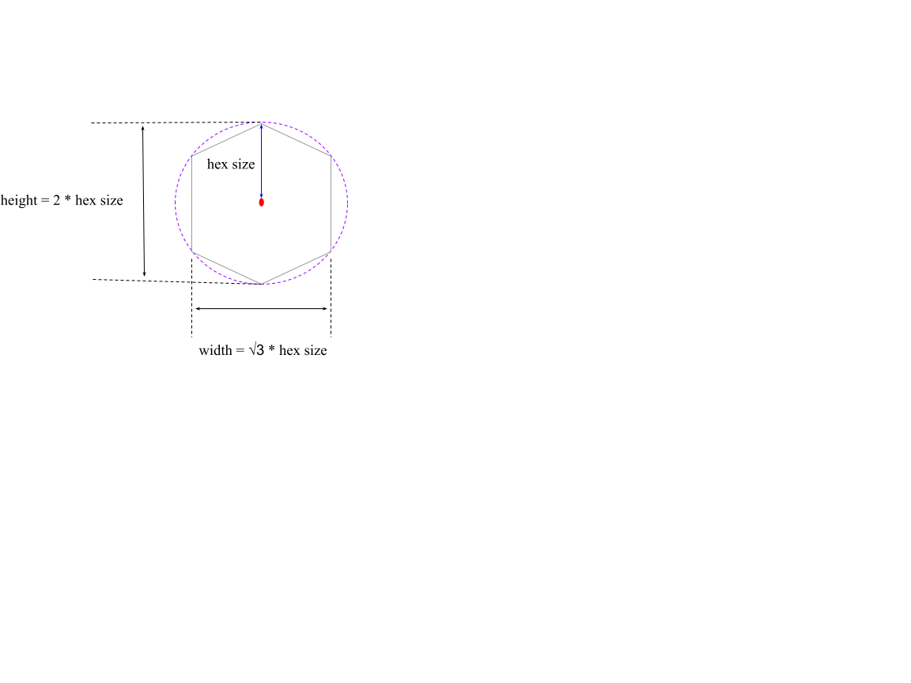
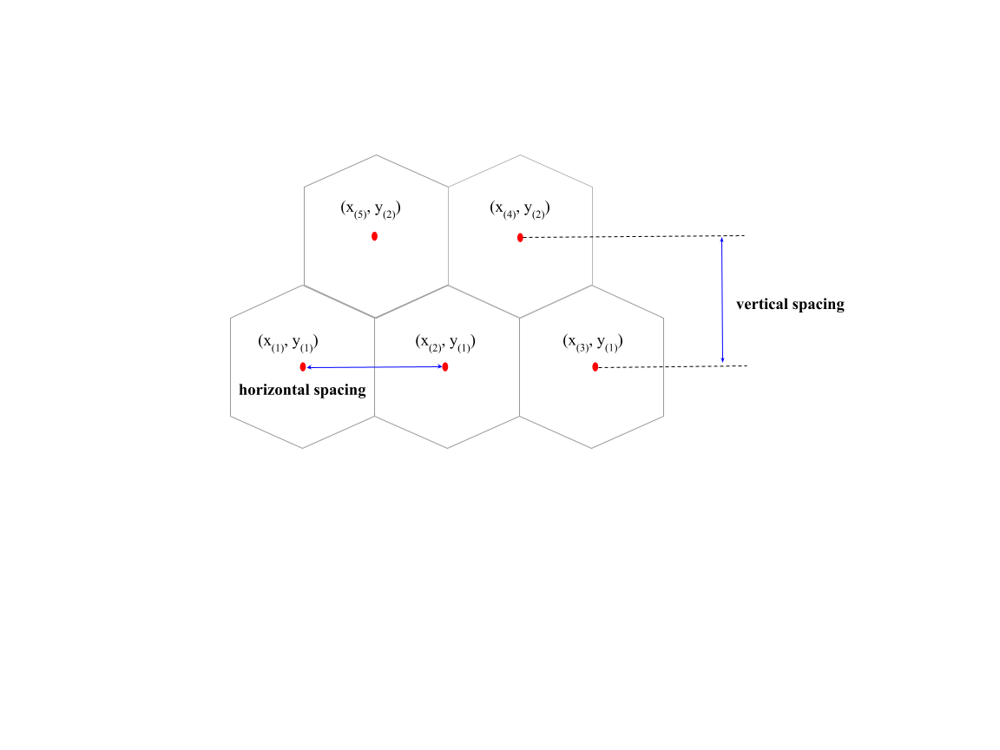
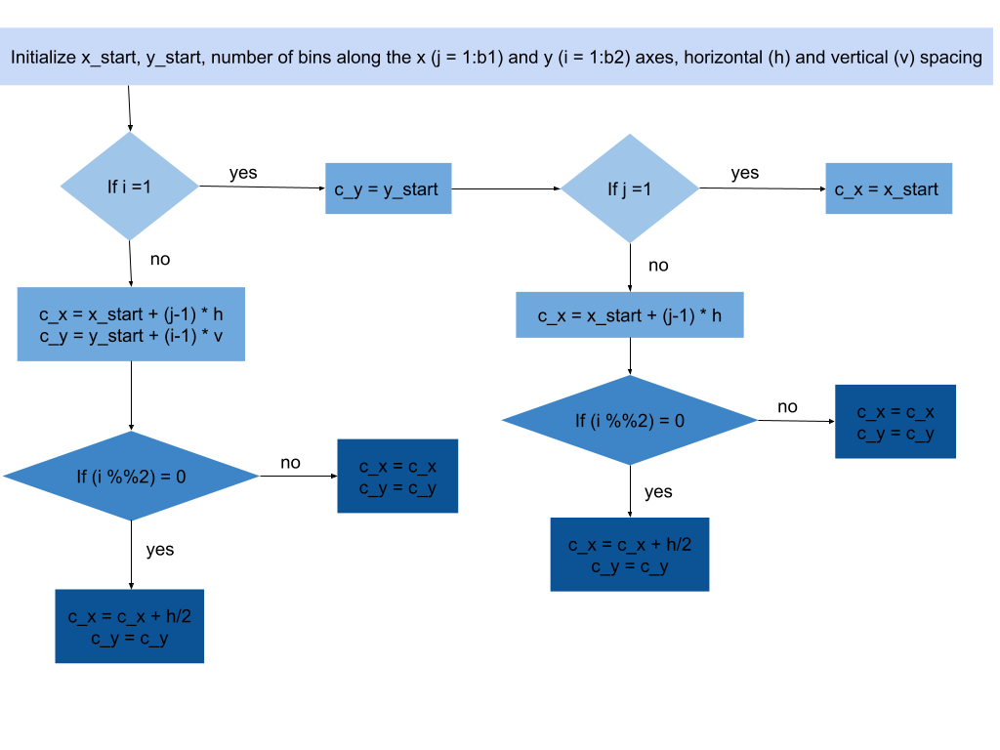
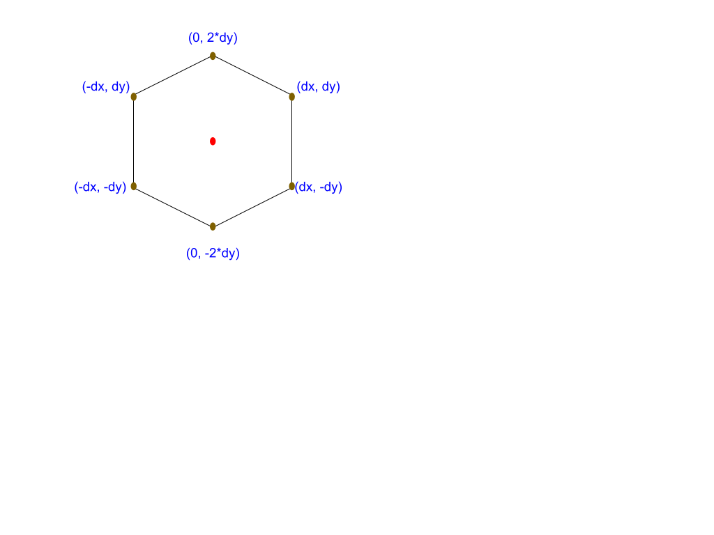
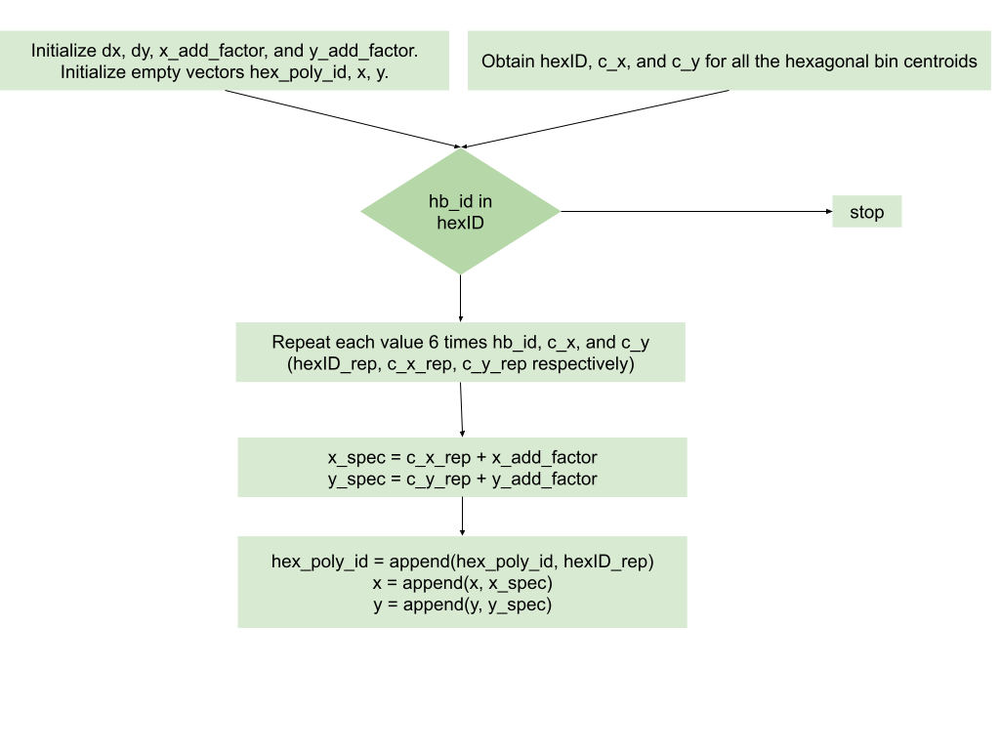

```{r setup, include=FALSE}
knitr::opts_chunk$set(warning = FALSE, 
                      message = FALSE)
source("quollr_code.R", local = TRUE)
source("nldr_code.R", local = TRUE)
```

```{r load-libraries}
#library(quollr)
library(knitr)
library(kableExtra)
library(readr)
library(ggplot2)
library(dplyr)
library(ggbeeswarm)
library(Rtsne)
library(umap)
library(phateR)
library(reticulate)
library(rsample)

set.seed(20230531)

# use_python("~/miniforge3/envs/pcamp_env/bin/python")
# use_condaenv("pcamp_env")
# 
# reticulate::source_python(paste0(here::here(), "/scripts/function_scripts/Fit_PacMAP_code.py"))
# reticulate::source_python(paste0(here::here(), "/scripts/function_scripts/Fit_TriMAP_code.py"))

```

```{r}
#| echo: false

training_data <- read_rds(file = "data/s_curve_noise_training.rds")
test_data <- read_rds(file = "data/s_curve_noise_test.rds")

s_curve_noise <- read_rds(file = "data/s_curve_noise.rds")
s_curve_noise_umap <- read_rds(file = "data/s_curve_noise_umap.rds")
```

```{r}
library(scales)
s_curve_noise_umap$UMAP1 <- rescale(s_curve_noise_umap$UMAP1)

y_min <- -sqrt(3)/2
y_max <- sqrt(3)/2

# y_min <- 0
# y_max <- sqrt(3)/2

s_curve_noise_umap$UMAP2 <- ((s_curve_noise_umap$UMAP2 - min(s_curve_noise_umap$UMAP2))/(max(s_curve_noise_umap$UMAP2) - min(s_curve_noise_umap$UMAP2))) * (y_max - y_min)

# Define the desired size of the hexagons
hex_size <- 0.2

# Compute the horizontal spacing (dx) and vertical spacing (dy) between hexagon centers
# dx <- sqrt(3) * hex_size
# dy <- 1.5 * hex_size 

# x_length <- 1
# y_length_scaled <- diff(range(s_curve_noise_umap$UMAP2))

# Compute the number of bins along the x-axis and y-axis
# num_bins_x <- ceiling(x_length / dx)
# num_bins_y <- ceiling(y_length_scaled / dy)
```

```{r}
# s_curve_noise_umap[,1:(NCOL(s_curve_noise_umap) - 1)] <- scale(s_curve_noise_umap[,1:(NCOL(s_curve_noise_umap) - 1)])
```
 
# Introduction

# Methodology

## Usage

- dependencies

```{r, eval=FALSE}
library(tools)
package_dependencies("quollr")
```

- basic example

### Datasets

The `quollr` package comes with several data sets that load with the package. These are described in Table `r knitr::asis_output(ifelse(knitr::is_html_output(), '\\@ref(tab:datasets-tb-html)', '\\@ref(tab:datasets-tb-pdf)'))`.

```{r, echo=FALSE}
datasets_tb <- tibble(dt = c("s_curve_noise",
                             "s_curve_noise_training", 
                             "s_curve_noise_test", 
                             "s_curve_noise_umap"), 
                      text = c("Simulated 3D S-curve data with additional four noise dimensions.",
                               "Training data derived from S-curve data.", 
                               "Test data derived from S-curve data.", 
                               "UMAP 2D embedding data of S-curve data (n_neighbors: 15, min_dist: 0.1)."))
```

```{r datasets-tb-html, eval=is_html_output(), echo=FALSE}
datasets_tb |> 
  kable(caption = "quollr datasets", col.names = c("data", "explanation")) 
```

```{r datasets-tb-pdf, eval=is_latex_output(), echo=FALSE}
datasets_tb |>
  kable(caption = "quollr datasets", format="latex", col.names = c("data", "explanation"), booktabs = T)  |>
  column_spec(1, width = "4cm") |>
  column_spec(2, width = "8cm")
```
## Preprocessing

In the preprocessing stage, we aim to prepare our data to fit within the bounds required for regular hexagonal binning, ensuring effective visualization. To achieve this, we implement two key scaling steps. Firstly, we scale the first 2D embedding component to range between $0$ and $1$, ensuring that all data points fall within this normalized interval. Secondly, we scale the second 2D embedding component to range between $-\frac{\sqrt{3}}{2}$ and $\frac{\sqrt{3}}{2}$. This adjustment helps maintain the necessary symmetry and spacing required for regular hexagons. 

## Compute hexagonal bin configurations

Hexagonal binning is a powerful technique for visualizing the density of data points in a 2-d space. Unlike traditional rectangular bins, hexagonal bins offer several advantages, including a more uniform representation of density and reduced visual bias. However, to effectively do the hexagonal binning, it's essential to compute the appropriate configurations based on the characteristics of the dataset. 

Before computing hexagonal bin configurations, we need to determine the range of data along the x and y axes to establish the boundary for hexagonal binning. Additionally, choosing an appropriate hexagon size (the radius of the outer circle) is essential. By default, the `calculate_effective_x_bins()` and `calculate_effective_y_bins()` functions use a hexagon size of $0.2$. However, users can adjust the hexagon size to fit the data range and achieve regular hexagons without overlapping.

The hexagon size directly affects the number of bins generated. A higher hexagonal size will result in fewer bins, while a lower hexagonal size will lead to more bins. Therefore, there's always a trade-off depending on the dataset used. Users should consider their specific data characteristics when selecting the hexagon size.

```{r hex-size-img, out.width = "100%", out.height = "100%", fig.cap = "Hexagonal size parameter", fig.alt="Hexagonal size parameter", echo=FALSE}

```

```{r spacing-img, out.width = "100%", out.height = "100%", fig.cap = "Horizontal and vertical spacing parameters", fig.alt="Horizontal and vertical spacing parameters", echo=FALSE}

```

### Number of bins along the x-axis ($b_1$)

In the process of computing hexagonal bin configurations, the first step involves determining the number of bins along the x-axis. This begins with the initialization of parameters such as the hexagonal size ($s$) and the buffer along the x-axis. Subsequently, the range of the first 2D embedding component ($r_1$) is calculated to ensure comprehensive coverage of the data. This range is then adjusted by incorporating the buffer amount, effectively expanding the boundary to accommodate potential outliers or edge cases. The default buffer amount along the x-axis is $\sqrt{3} * s * 1.5$. Next, the horizontal spacing ($h$) between hexagons is computed based on the hexagon size. Finally, the number of bins along the x-axis is computed based on the adjusted range ($r_1 + buffer_{x}$) and the horizontal spacing ($h$).

$$
h = \sqrt{3} * s
$${#eq-equation3}

$$
 b_1 = \frac{r_1 + buffer_{x}}{h}
$${#eq-equation4}


```{r}
num_bins_x <- calculate_effective_x_bins(.data = s_curve_noise_umap,
                                         x = "UMAP1", hex_size = 0.2)
num_bins_x 
```

### Number of bins along the y-axis ($b_2$)

In the process of computing hexagonal bin configurations, the second step involves determining the number of bins along the y-axis. This begins with the initialization of parameters such as the hexagonal size and the buffer along the y-axis. Subsequently, the range of the second 2D embedding component ($r_2$) is calculated to ensure comprehensive coverage of the data. This range is then adjusted by incorporating the buffer amount, effectively expanding the boundary to accommodate potential outliers or edge cases. The default buffer amount along the y-axis is $1.5 * s * 1.5$. Next, the vertical spacing ($v$) between hexagons is computed based on the hexagon size. Finally, the number of bins along the y-axis is computed based on the adjusted range ($r_2 + buffer_{y}$) and the vertical spacing ($v$).

$$
v = 1.5 * s
$${#eq-equation5}

$$
 b_2 = \frac{r_2 + buffer_{y}}{v}
$${#eq-equation6}

```{r}
num_bins_y <- calculate_effective_y_bins(.data = s_curve_noise_umap,
                                         y = "UMAP2", hex_size = 0.2)
num_bins_y 
```

### Generate full hex grid

Generating full hexagonal grid contains main four steps:

1. Generate all the hexagonal bin centroids

The default $x_{start}$ and $y_{start}$ can be defined as:

$$
x_{start} = min(emb_1) - \frac{\sqrt{3} * s}{2}
$${#eq-equation7}

$$
y_{start} = min(emb_2) - \frac{1.5 * s}{2}
$${#eq-equation8}

```{r gen-fullcentroids, out.width = "100%", out.height = "100%", fig.cap = "Workflow of generating hexagonal bin centroids", fig.alt="Workflow of generating hexagonal bin centroids", echo=FALSE}

```


```{r}
all_centroids_df <- generate_full_grid_centroids(nldr_df = s_curve_noise_umap, 
                                                 x = "UMAP1", y = "UMAP2", 
                                                 num_bins_x = num_bins_x, 
                                                 num_bins_y = num_bins_y, 
                                                 x_start = NA, y_start = NA, 
                                                 hex_size = 0.2)

glimpse(all_centroids_df)
```

2. Generate hexagonal coordinates

$$
dx = \frac{x_{(2)} - x_{(1)}}{2}
$${#eq-equation9}


$$
dy = \frac{2*(y_{(2)} - y_{(1)}) * 1.15}{\sqrt{3}}
$${#eq-equation10}

```{r hex-coordinates, out.width = "100%", out.height = "100%", fig.cap = "Hexagon coordinates", fig.alt="Hexagon coordinates", echo=FALSE}

```

```{r gen-allcoordinates, out.width = "100%", out.height = "100%", fig.cap = "Workflow of generating hexagon coordinates", fig.alt="Workflow of generating hexagon coordinates", echo=FALSE}

```

```{r}
hex_grid <- gen_hex_coordinates(all_centroids_df, hex_size = 0.2)
glimpse(hex_grid)
```

```{r}
ggplot(data = hex_grid, aes(x = x, y = y)) + geom_polygon(fill = "white", color = "black", aes(group = id)) +
  geom_point(aes(x = c_x, y = c_y), color = "red") +
  coord_fixed()
```

```{r}
ggplot(data = hex_grid, aes(x = x, y = y)) + geom_polygon(fill = "white", color = "black", aes(group = id)) +
  geom_text(aes(x = c_x, y = c_y, label = hexID)) +
  coord_fixed()
```

3. Assign data into hexagons

- Compute distances between nldr coordinates and hex bin centroids

- Find the hexagonal centroid that have the minimum distance

```{r}
s_curve_noise_umap_with_id <- assign_data(s_curve_noise_umap, hex_grid)
```

4. Compute standardized counts within each hexagon

- Compute number of data points within each hexagon

- Compute standardise count by dividing the counts by the maximum

```{r}
df_with_std_counts <- compute_std_counts(nldr_df_with_hex_id = s_curve_noise_umap_with_id)
```


```{r}
hex_full_count_df <- generate_full_grid_info(nldr_df = s_curve_noise_umap, hex_grid)
```


```{r}
ggplot(data = hex_grid, aes(x = x, y = y)) + geom_polygon(fill = "white", color = "black", aes(group = id)) +
  geom_point(data = s_curve_noise_umap, aes(x = UMAP1, y = UMAP2), color = "blue") +
  coord_fixed()
```

```{r}
ggplot(data = hex_full_count_df, aes(x = x, y = y)) +
  geom_polygon(color = "black", aes(group = id, fill = std_counts)) +
  geom_text(aes(x = c_x, y = c_y, label = hexID)) +
  scale_fill_viridis_c(direction = -1, na.value = "#ffffff") +
  coord_fixed()

```
<!--
#### Buffer size

When generating hexagonal bins in R, a buffer is often included to ensure that the data points are evenly distributed within the bins and to prevent edge effects. The buffer helps in two main ways:

1. **Preventing Edge Effects**: Without a buffer, the outermost data points might fall near the boundary of the hexagonal grid, leading to incomplete bins or uneven distribution of data. By adding a buffer, you create a margin around the outer edges of the grid, ensuring that all data points are fully enclosed within the bins.

2. **Ensuring Even Distribution**: The buffer allows for a smoother transition between adjacent bins. This helps in cases where data points are not perfectly aligned with the grid lines, ensuring that each data point is assigned to the nearest bin without bias towards any specific direction.

Overall, including a buffer when generating hexagonal bins helps to produce more accurate and robust binning results, particularly when dealing with real-world data that may have irregular distributions or boundary effects.
-->
### Construct the 2D model with different options

```{r}
df_bin_centroids <- hex_full_count_df[complete.cases(hex_full_count_df[["std_counts"]]), ] |>
  dplyr::select("c_x", "c_y", "hexID", "std_counts") |>
  dplyr::distinct() |>
  dplyr::rename(c("x" = "c_x", "y" = "c_y"))
  
df_bin_centroids
```

### Construct the high-D model with different options

```{r}
## To generate a data set with high-D and 2D training data
df_all <- training_data |> dplyr::select(-ID) |>
  dplyr::bind_cols(s_curve_noise_umap_with_id)

## To generate averaged high-D data

df_bin <- avg_highD_data(.data = df_all, column_start_text = "x") ## Need to pass ID column name
```

### Generate the triangular mesh

```{r}
tr1_object <- triangulate_bin_centroids(df_bin_centroids, x = "x", y = "y")
tr_from_to_df <- generate_edge_info(triangular_object = tr1_object)
```

### Compute parameter defaults

#### Benchmark value to remove the low-density hexagons

#### Benchmark value to remove the long edges

```{r}
## Compute 2D distances
distance <- cal_2d_dist(tr_from_to_df_coord = tr_from_to_df)

## To plot the distribution of distance
plot_dist <- function(distance_df){
  distance_df$group <- "1"
  dist_plot <- ggplot(distance_df, aes(x = group, y = distance)) +
    geom_quasirandom()+
    ylim(0, max(unlist(distance_df$distance))+ 0.5) + coord_flip()
  return(dist_plot)
}

plot_dist(distance)

benchmark <- find_benchmark_value(distance_edges = distance, distance_col = "distance")
benchmark

benchmark <- 0.75
```

### Model function

`fit_high_d_model()` function is used to generate the 2D model and the high-D model. 


```{r}
## To generate a data set with high-D and 2D training data
df_all <- training_data |> dplyr::select(-ID) |>
  dplyr::bind_cols(s_curve_noise_umap_with_id)

## To generate averaged high-D data

df_bin <- avg_highD_data(.data = df_all, column_start_text = "x") ## Need to pass ID column name
```

### Predict 2D embeddings

To predict the 2D embeddings for a new data point using the trained high-D model, we follow a series of steps outlined below:

1. **Compute high-dimensional Euclidean distance**: Calculate the Euclidean distance between each new data point and the lift model's coordinates in the high-dimensional space. This distance metric helps identify the nearest lift model coordinates to each new data point.

2. **Find the nearest lift model coordinates**: Determine the lift model's high-dimensional coordinates that are closest to each new data point based on the computed distances. This step helps establish a correspondence between the new data points and the lift model's representation in the high-dimensional space.

3. **Map the hexagonal bin ID**: Assign each new data point to a hexagonal bin based on its nearest lift model coordinates. This mapping ensures that each data point is associated with a specific region in the hexagonal grid representation of the high-dimensional space.

4. **Map the hexagonal bin centroid coordinates in 2D**: Transform the hexagonal bin centroid coordinates from the high-dimensional space to the 2D embedding space using the trained lift model. This mapping provides the 2D embeddings for the new data points, allowing them to be visualized and analyzed in a lower-dimensional space.

The `predict_2d_embeddings()` function is used to predict 2D embeddings for a new data point. The inputs for the function are test data, bin centroid coordinates in 2D, lifting model coordinates in high-D, and the type of the NLDR technique. The output contains the predicted 2D embeddings along with the predicted hexagonal id and the ID of the test data.   

```{r}
pred_df_test <- predict_2d_embeddings(test_data = training_data,
df_bin_centroids = df_bin_centroids, df_bin = df_bin, type_NLDR = "UMAP")

glimpse(pred_df_test)
```

### Making summaries

There are two important summaries that should be made when constructing the model on a dataset using a specific NLDR technique, the Mean Square Error (MSE) and Akaike Information Criterion (AIC) which measure prediction accuracy. The function that perform the summaries called `generate_eval_df()`. The output of this function is a list which contains MSE and AIC. The code below uses `generate_eval_df()` to find the MSE and the AIC values for the model constructed on UMAP 2D embeddings generated from the `s_curve_noise` training data.

```{r}
generate_summary(test_data = training_data, prediction_df = pred_df_test,
                 df_bin = df_bin, col_start = "x")
```

### Visualizations

We use static visualizations to understand the model constructed in 2D. On the other hand, dynamic visualization is used to see how the model looks in high-D space.

#### Static visualizations

Static visualizations main involves two types of results. One is the triangulation and the other is the long edge removal. Both types of visualizations provide ggplot objects.

- Triangulation result: To visualize the results of triangulation, we input a dataset containing hexagonal bin centroid coordinates where 2D embedding data exists. `geom_trimesh()` is used to visualize this result.

- Long edge removal: The long edge removal process involves identifying and removing long edges from the triangular mesh. Table  shows the main arguments of the functions. We offer two functions for visualizing this process:

- `colour_long_edges()`: This function colors the long edges within the triangular mesh by red.

- `remove_long_edges()`: After identifying long edges, this function draws the triangular mesh without the long edges. 


#### Dynamic visaulizations

The `show_langevitour()` function enables dynamic visualization of the 2D model alongside the high-dimensional (high-D) data in its original space. This visualization is facilitated by langevitour object, allowing users to interactively explore the relationship between the 2D embeddings and the underlying high-dimensional data. The main arguments are shown in Table 


```{r}
trimesh <- ggplot(df_bin_centroids, aes(x = x, y = y)) +
  geom_point(size = 0.1) +
  geom_trimesh() +
  coord_equal()

trimesh
```


```{r}
trimesh_gr <- colour_long_edges(distance_edges = distance, benchmark_value = benchmark,
                                tr_from_to_df_coord = tr_from_to_df, distance_col = "distance")

trimesh_gr
```


```{r}
trimesh_removed <- remove_long_edges(distance_edges = distance, benchmark_value = benchmark,
                                     tr_from_to_df_coord = tr_from_to_df, distance_col = "distance")
trimesh_removed
```

```{r}
tour1 <- show_langevitour(df_all, df_bin, df_bin_centroids, 
                          benchmark_value = benchmark,
                          distance = distance, distance_col = "distance", 
                          use_default_benchmark_val = FALSE, 
                          column_start_text = "x")
tour1
```

### Find non-empty bins

## Tests

All functions have tests written and implemented using the \CRANpkg{testthat} [@testthat] in R. 

# Application


# Conclusion

# Acknowledgements

This article is created using \CRANpkg{knitr} [@knitr] and \CRANpkg{rmarkdown} [@rmarkdown] in R with the `rjtools::rjournal_article` template. The source code for reproducing this paper can be found at: [https://github.com/JayaniLakshika/paper-quollr](https://github.com/JayaniLakshika/paper-quollr).

