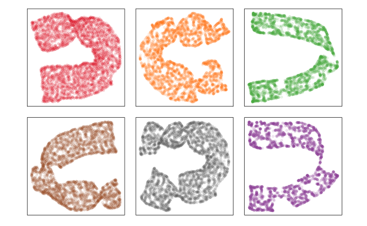
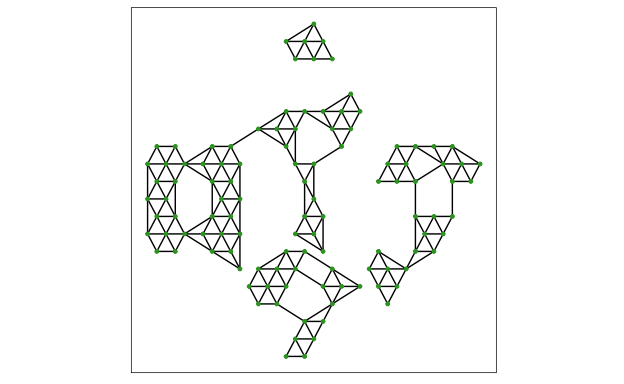
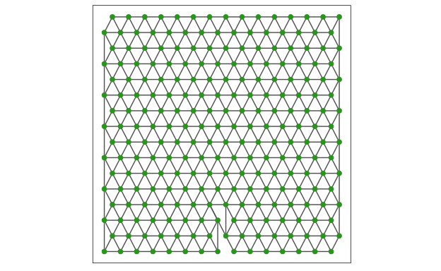
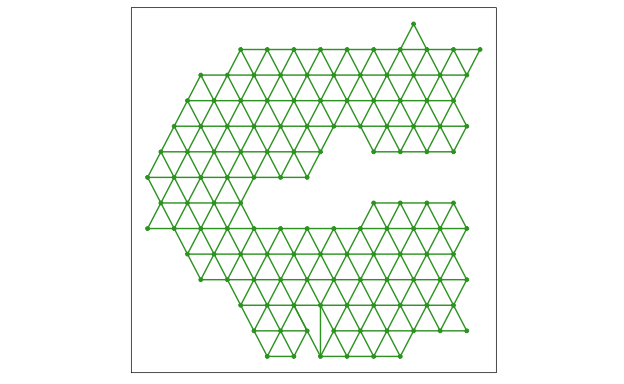
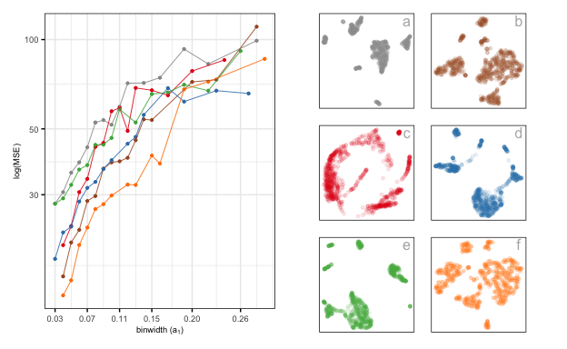

<div class="layout-chunk" data-layout="l-body">


</div>


<div class="layout-chunk" data-layout="l-body">


</div>


<div class="layout-chunk" data-layout="l-body">


</div>


<!-- 20 pages-->

# Introduction

<!-- research gap: add about hexbin pkg, and emphasize that in our package provide regular hexagons-->
<!-- objective: introduce a new tool to help to determine which method, which parameter choice provide the most useful representation of high-D data.--> 
<!--intro with S-curve with 5 methods-->

This paper presents the R package, `quollr` which introduce a new visual tool in determining which Non-linear dimension reduction (NLDR) technique and which (hyper)parameter choice gives most accurate representation of high-dimensional data. The methodology of the algorithm is explained in *cite the methodology paper*. Furthermore, the `quollr` package enables users to perform hexagonal binning [@dan2023], resulting in the generation of regular hexagons. The software is available from the Comprehensive R Archive Network (CARN) at [https://CRAN.R-project.org/package=quollr](https://CRAN.R-project.org/package=quollr).

Add the image generated with S-curve data

<div class="layout-chunk" data-layout="l-body">


</div>


<div class="layout-chunk" data-layout="l-body">


</div>


The paper is organized as follows. In next section, introduces the implementation of `quollr` package on CRAN, including demonstration of the package's key functions and visualization capabilities. We illustrate the algorithm's functionality to study about clustering data structure in **Application** section, and describe a visual heuristic to describe parameter selection. Finally, we give a brief conclusion of the paper and discuss potential opportunities for use of our algorithm.

# Implementation

## Installation

The package can be installed from CRAN:

```r
install.packages("quollr")
```

and the development version can be installed from GitHub:

```r
devtools::install_github("JayaniLakshika/quollr")
```

## Web site

More documentation of the package can be found at the web site [https://jayanilakshika.github.io/quollr/](https://jayanilakshika.github.io/quollr/).

## Package dependencies

Understanding the dependencies of the `quollr` package is essential for smooth operation and error prevention. The following dependencies refer to the other R packages that `quollr` relies on to execute its functions effectively. 

<div class="layout-chunk" data-layout="l-body">

```
$quollr
 [1] "dplyr"       "ggplot2"     "grid"        "interp"     
 [5] "langevitour" "proxy"       "rlang"       "rsample"    
 [9] "stats"       "tibble"      "tidyselect" 
```

</div>


## Data sets

Add a table of data sets that quollr have

<!-- ## Usage -->

<!-- add about main function to gen 2D and highD models-->
<!--Discuss the model can be generated with bin centroids or bin means-->

The following demonstration of the package's functionality assumes `quollr` has been loaded. We also want to load the built-in data sets `scurve` and `scurve_umap`. 

`scurve` is a $7\text{-}D$ simulated dataset. It is constructed by simulating $5000$ observations from $\theta \sim U(-3\pi/2, 3\pi/2)$, $X_1 = \sin(\theta)$, $X_2 \sim U(0, 2)$ (adding thickness to the S), $X_3 = \text{sign}(\theta) \times (\cos(\theta) - 1)$. The remaining variables $X_4, X_5, X_6, X_7$ are all uniform error, with small variance. `scurve_umap` is the UMAP $2\text{-}D$ embedding for `scurve` data with `n_neighbors` is $46$ and `min_dist` is $0.9$. Each data set contains a unique ID column that maps `scurve` and `scurve_umap`. 

## Main function

The mains steps for the algorithm can be executed by the main function `fit_highd_model()`, or can be run separately for more flexibility. 

<!-- If a user would like to perform steps of the algorithm themselves, additional user input will be needed for the function that perform each step. For example, if the user wishes to use already binning data, the `extract_hexbin_centroids()` function can be used directly. -->

This function requires several parameters: the high-dimensional data (`highd_data`), the emdedding data (`nldr_data`), the number of bins along the x-axis (`bin1`), the buffer amount as a proportion of data (`q`), and benchmark value to extract high density hexagons (`benchmark_highdens`). The function returns an object that includes the hexagonal object, the fitted model in both $2\text{-}D$, and $p\text{-}D$, and triangular mesh.  

<div class="layout-chunk" data-layout="l-body">
<div class="sourceCode"><pre class="sourceCode r"><code class="sourceCode r"><span><span class='fu'>fit_highd_model</span><span class='op'>(</span></span>
<span>  highd_data <span class='op'>=</span> <span class='va'>scurve</span>, </span>
<span>  nldr_data <span class='op'>=</span> <span class='va'>scurve_umap</span>, </span>
<span>  bin1 <span class='op'>=</span> <span class='fl'>15</span>, </span>
<span>  q <span class='op'>=</span> <span class='fl'>0.1</span>, </span>
<span>  benchmark_highdens <span class='op'>=</span> <span class='fl'>5</span><span class='op'>)</span></span></code></pre></div>

```
$hb_obj
$a1
[1] 0.08326136

$a2
[1] 0.07210645

$bins
[1] 15 16

$start_point
[1] -0.10000000 -0.08923607

$centroids
# A tibble: 240 × 3
   hexID     c_x     c_y
   <int>   <dbl>   <dbl>
 1     1 -0.1    -0.0892
 2     2 -0.0167 -0.0892
 3     3  0.0665 -0.0892
 4     4  0.150  -0.0892
 5     5  0.233  -0.0892
 6     6  0.316  -0.0892
 7     7  0.400  -0.0892
 8     8  0.483  -0.0892
 9     9  0.566  -0.0892
10    10  0.649  -0.0892
# ℹ 230 more rows

$hex_poly
# A tibble: 1,440 × 3
   hex_poly_id       x       y
         <int>   <dbl>   <dbl>
 1           1 -0.1    -0.0412
 2           1 -0.142  -0.0652
 3           1 -0.142  -0.113 
 4           1 -0.1    -0.137 
 5           1 -0.0584 -0.113 
 6           1 -0.0584 -0.0652
 7           2 -0.0167 -0.0412
 8           2 -0.0584 -0.0652
 9           2 -0.0584 -0.113 
10           2 -0.0167 -0.137 
# ℹ 1,430 more rows

$data_hb_id
# A tibble: 5,000 × 4
    emb1  emb2    ID hexID
   <dbl> <dbl> <int> <int>
 1 0.707 0.839     1   205
 2 0.231 0.401     2   109
 3 0.232 0.215     3    65
 4 0.790 0.564     4   146
 5 0.761 0.551     5   146
 6 0.445 0.721     6   172
 7 0.900 0.137     7    58
 8 0.247 0.392     8   110
 9 0.325 0.542     9   141
10 0.278 0.231    10    80
# ℹ 4,990 more rows

$std_cts
# A tibble: 142 × 3
   hexID bin_counts std_counts
   <int>      <int>      <dbl>
 1    21         12     0.16  
 2    22         17     0.227 
 3    23         22     0.293 
 4    24         10     0.133 
 5    25          7     0.0933
 6    26         12     0.16  
 7    27          1     0.0133
 8    36         42     0.56  
 9    37         42     0.56  
10    38         44     0.587 
# ℹ 132 more rows

$tot_bins
[1] 240

$non_bins
[1] 142

$pts_bins
# A tibble: 142 × 2
   hexID pts_list  
   <int> <list>    
 1    21 <int [12]>
 2    22 <int [17]>
 3    23 <int [22]>
 4    24 <int [10]>
 5    25 <int [7]> 
 6    26 <int [12]>
 7    27 <int [1]> 
 8    36 <int [42]>
 9    37 <int [42]>
10    38 <int [44]>
# ℹ 132 more rows

attr(,"class")
[1] "hex_bin_obj"

$model_highd
# A tibble: 130 × 8
   hexID      x1    x2    x3         x4        x5       x6        x7
   <int>   <dbl> <dbl> <dbl>      <dbl>     <dbl>    <dbl>     <dbl>
 1    21 -0.992   1.91 1.11  -0.000427   0.000624  0.00749  0.00105 
 2    22 -0.906   1.93 1.41  -0.0000183  0.00331  -0.0204  -0.000363
 3    23 -0.680   1.93 1.72  -0.000810  -0.00259  -0.00449  0.00153 
 4    24 -0.272   1.93 1.96   0.00251    0.00668  -0.0460   0.00128 
 5    25  0.0760  1.93 2.00   0.00876    0.00447   0.00851 -0.00195 
 6    26  0.461   1.93 1.89  -0.00478    0.00492   0.00835  0.00172 
 7    36 -0.985   1.75 0.853 -0.00202    0.000397  0.00331  0.000338
 8    37 -0.980   1.66 1.17  -0.000374  -0.00154   0.0165   0.000126
 9    38 -0.821   1.64 1.56  -0.000459   0.000538 -0.0123   0.000780
10    39 -0.484   1.68 1.87   0.00313    0.00241   0.00823 -0.00117 
# ℹ 120 more rows

$model_2d
# A tibble: 130 × 5
   hexID   c_x     c_y bin_counts std_counts
   <int> <dbl>   <dbl>      <dbl>      <dbl>
 1    21 0.358 -0.0171         12     0.16  
 2    22 0.441 -0.0171         17     0.227 
 3    23 0.524 -0.0171         22     0.293 
 4    24 0.608 -0.0171         10     0.133 
 5    25 0.691 -0.0171          7     0.0933
 6    26 0.774 -0.0171         12     0.16  
 7    36 0.316  0.0550         42     0.56  
 8    37 0.400  0.0550         42     0.56  
 9    38 0.483  0.0550         44     0.587 
10    39 0.566  0.0550         39     0.52  
# ℹ 120 more rows

$trimesh_data
# A tibble: 322 × 8
    from    to x_from  y_from  x_to   y_to from_count to_count
   <int> <int>  <dbl>   <dbl> <dbl>  <dbl>      <dbl>    <dbl>
 1    50    65 0.275   0.127  0.233 0.199          65       67
 2    64    65 0.150   0.199  0.233 0.199          39       67
 3    64    79 0.150   0.199  0.191 0.271          39       62
 4    78    94 0.108   0.271  0.150 0.343          62       34
 5    78    79 0.108   0.271  0.191 0.271          62       62
 6    21    36 0.358  -0.0171 0.316 0.0550         12       42
 7    93    94 0.0665  0.343  0.150 0.343          45       34
 8    79    80 0.191   0.271  0.275 0.271          62       68
 9    65    66 0.233   0.199  0.316 0.199          67       56
10    66    80 0.316   0.199  0.275 0.271          56       68
# ℹ 312 more rows
```

</div>


## Constructing the $2\text{-}D$ Model

Constructing the $2\text{-}D$ model primarily involves (i) scaling the NLDR data, (ii) binning the data, (iii) obtaining bin centroids, (iv) connecting centroids with line segments to indicate neighbors, and (v) Remove low-density hexagons.

### Scaling the Data

The algorithm starts by scaling the NLDR data to a standard range using the `gen_scaled_data()` function. This function standardizes the data so that the first embedding ranges from $0$ to $1$, while the second embedding scales from $0$ to the maximum value of the second embedding. The output includes the scaled NLDR data along with the original limits of the embeddings.

<div class="layout-chunk" data-layout="l-body">
<div class="sourceCode"><pre class="sourceCode r"><code class="sourceCode r"><span><span class='va'>scurve_umap_obj</span> <span class='op'>&lt;-</span> <span class='fu'>gen_scaled_data</span><span class='op'>(</span>nldr_data <span class='op'>=</span> <span class='va'>scurve_umap</span><span class='op'>)</span></span>
<span></span>
<span><span class='va'>scurve_umap_obj</span></span></code></pre></div>

```
$scaled_nldr
# A tibble: 5,000 × 3
    emb1  emb2    ID
   <dbl> <dbl> <int>
 1 0.707 0.839     1
 2 0.231 0.401     2
 3 0.232 0.215     3
 4 0.790 0.564     4
 5 0.761 0.551     5
 6 0.445 0.721     6
 7 0.900 0.137     7
 8 0.247 0.392     8
 9 0.325 0.542     9
10 0.278 0.231    10
# ℹ 4,990 more rows

$lim1
[1] -14.42166  13.32655

$lim2
[1] -12.43687  12.32455
```

</div>


### Computing hexagon grid configurations

The configurations of a hexagonal grid are determined by the number of bins and the bin width in each direction. The function `calc_bins_y()` is used for this purpose. This function accepts an object containing scaled NLDR data in the first and second columns, along with numeric vectors that represent the limits of the original NLDR data, the number of bins along the x-axis (`bin1`), and the buffer amount as a proportion.

<div class="layout-chunk" data-layout="l-body">
<div class="sourceCode"><pre class="sourceCode r"><code class="sourceCode r"><span><span class='fu'>calc_bins_y</span><span class='op'>(</span></span>
<span>  nldr_obj <span class='op'>=</span> <span class='va'>scurve_umap_obj</span>, </span>
<span>  bin1 <span class='op'>=</span> <span class='fl'>15</span>, </span>
<span>  q <span class='op'>=</span> <span class='fl'>0.1</span><span class='op'>)</span></span></code></pre></div>

```
$bin2
[1] 16

$a1
[1] 0.08326136

$a2
[1] 0.07210645
```

</div>


### Binning the data

Points are allocated to bins based on the nearest centroid. The hexagonal binning algorithm can be executed using the `hex_binning()` function, or its components can be run separately for added flexibility. The parameters used within `hex_binning()` include an object containing scaled NLDR data in the first and second columns, along with numeric vectors that represent the limits of the original NLDR data (`nldr_obj`), the number of bins along the x-axis (`bin1`), and the buffer amount as a proportion of the data (`q`). The output is an object of the `hex_bin_obj` class, which contains the bin widths in each direction (`a1`, `a2`), the number of bins in each direction (`bins`), the coordinates of the hexagonal grid starting point (`start_point`), the details of bin centroids (`centroids`), the coordinates of bins (`hex_poly`), NLDR components with their corresponding hexagon IDs (`data_hb_id`), hex bins with their corresponding standardized counts (`std_cts`), the total number of bins (`tot_bins`), the number of non-empty bins (`non_bins`), and the points within each hexagon (`pts_bins`).  

<div class="layout-chunk" data-layout="l-body">
<div class="sourceCode"><pre class="sourceCode r"><code class="sourceCode r"><span><span class='va'>hb_obj</span> <span class='op'>&lt;-</span> <span class='fu'>hex_binning</span><span class='op'>(</span></span>
<span>  nldr_obj <span class='op'>=</span> <span class='va'>scurve_umap_obj</span>, </span>
<span>  bin1 <span class='op'>=</span> <span class='fl'>15</span>, </span>
<span>  q <span class='op'>=</span> <span class='fl'>0.1</span><span class='op'>)</span></span></code></pre></div>

</div>


<!--add each step separately-->
<!--add hexbin notation image-->

### Obtaining bin centroids

<div class="layout-chunk" data-layout="l-body">
<div class="sourceCode"><pre class="sourceCode r"><code class="sourceCode r"><span><span class='va'>df_bin_centroids</span> <span class='op'>&lt;-</span> <span class='fu'>extract_hexbin_centroids</span><span class='op'>(</span></span>
<span>  centroids_data <span class='op'>=</span> <span class='va'>hb_obj</span><span class='op'>$</span><span class='va'>centroids</span>, </span>
<span>  counts_data <span class='op'>=</span> <span class='va'>hb_obj</span><span class='op'>$</span><span class='va'>std_cts</span></span>
<span>  <span class='op'>)</span></span>
<span></span>
<span><span class='va'>df_bin_centroids</span></span></code></pre></div>

```
# A tibble: 240 × 5
   hexID     c_x     c_y bin_counts std_counts
   <int>   <dbl>   <dbl>      <dbl>      <dbl>
 1     1 -0.1    -0.0892          0          0
 2     2 -0.0167 -0.0892          0          0
 3     3  0.0665 -0.0892          0          0
 4     4  0.150  -0.0892          0          0
 5     5  0.233  -0.0892          0          0
 6     6  0.316  -0.0892          0          0
 7     7  0.400  -0.0892          0          0
 8     8  0.483  -0.0892          0          0
 9     9  0.566  -0.0892          0          0
10    10  0.649  -0.0892          0          0
# ℹ 230 more rows
```

</div>


### Indicating neighbors by line segments connecting centroids

To indicate neighbors, the `tri_bin_centroids()` function is used to triangulate bin centroids. Following this, `gen_edges()` function computes the line segments that connect neighboring bins by providing the triangulated data. This results the coordinates that generate the connecting lines.

<div class="layout-chunk" data-layout="l-body">
<div class="sourceCode"><pre class="sourceCode r"><code class="sourceCode r"><span><span class='va'>tr_object</span> <span class='op'>&lt;-</span> <span class='fu'>tri_bin_centroids</span><span class='op'>(</span></span>
<span>  centroids_data <span class='op'>=</span> <span class='va'>df_bin_centroids</span></span>
<span>  <span class='op'>)</span></span>
<span></span>
<span><span class='va'>trimesh</span> <span class='op'>&lt;-</span> <span class='fu'>gen_edges</span><span class='op'>(</span>tri_object <span class='op'>=</span> <span class='va'>tr_object</span>, a1 <span class='op'>=</span> <span class='va'>hb_obj</span><span class='op'>$</span><span class='va'>a1</span><span class='op'>)</span></span>
<span><span class='va'>trimesh</span></span></code></pre></div>

```
# A tibble: 653 × 8
    from    to  x_from  y_from    x_to    y_to from_count to_count
   <int> <int>   <dbl>   <dbl>   <dbl>   <dbl>      <dbl>    <dbl>
 1     1     2 -0.1    -0.0892 -0.0167 -0.0892          0        0
 2    16    17 -0.0584 -0.0171  0.0249 -0.0171          0        0
 3    16    32 -0.0584 -0.0171 -0.0167  0.0550          0        0
 4     3    17  0.0665 -0.0892  0.0249 -0.0171          0        0
 5    17    18  0.0249 -0.0171  0.108  -0.0171          0        0
 6    17    33  0.0249 -0.0171  0.0665  0.0550          0        0
 7    31    46 -0.1     0.0550 -0.0584  0.127           0        0
 8    32    47 -0.0167  0.0550  0.0249  0.127           0        0
 9    32    33 -0.0167  0.0550  0.0665  0.0550          0        0
10     4    18  0.150  -0.0892  0.108  -0.0171          0        0
# ℹ 643 more rows
```

</div>


In some cases, distant centroids may be connected, resulting in long line segments that can affect the smoothness of the $2\text{-}D$ representation. To address this issue, the `find_lg_benchmark()` function is used. This function computes a threshold based on the distances of line segments, determining when long edges should be removed. 

### Remove low-density hexagons

In certain scenarios, hexagonal bins may contain a few number of points. To ensure comprehensive coverage of NLDR data, it is important to select hexagonal bins with a suitable number of data points. The `find_low_dens_hex()` function identifies hexagons with low point densities, considering the densities of their neighboring bins as well. Users can initially identify low-density hexagons and then use this function to evaluate how removing them might affect the model fit by examining their neighbors.

<div class="layout-chunk" data-layout="l-body">
<div class="sourceCode"><pre class="sourceCode r"><code class="sourceCode r"><span><span class='fu'>find_low_dens_hex</span><span class='op'>(</span></span>
<span>  centroids_data <span class='op'>=</span> <span class='va'>df_bin_centroids</span>, </span>
<span>  bin1 <span class='op'>=</span> <span class='fl'>15</span>, </span>
<span>  benchmark_mean_dens <span class='op'>=</span> <span class='fl'>0.05</span></span>
<span><span class='op'>)</span></span></code></pre></div>

```
 [1]   1   2   3   4   5  11  12  13  14  15  16  17  18  19  30  31
[17]  32  33  46  47  61  75  76  90 105 120 135 150 151 166 181 182
[33] 196 197 198 211 212 213 214 215 225 226 227 228 229 230 231 232
[49] 233 234 235 236 237 238 239 240
```

</div>


## Lifting the model into high dimensions

The final step involves lifting the fitted $2\text{-}D$ model into $p\text{-}D$ by computing the $p\text{-}D$ mean of data points within each hexgaonal bin to represent bin centroids. This transformation is performed using the `avg_highd_data()` function, which takes $p\text{-}D$ data (`highd_data`) and embedding data with their corresponding hexagonal bin IDs as inputs (`scaled_nldr_hexid`).

<div class="layout-chunk" data-layout="l-body">
<div class="sourceCode"><pre class="sourceCode r"><code class="sourceCode r"><span><span class='va'>df_bin</span> <span class='op'>&lt;-</span> <span class='fu'>avg_highd_data</span><span class='op'>(</span></span>
<span>  highd_data <span class='op'>=</span> <span class='va'>scurve</span>, </span>
<span>  scaled_nldr_hexid <span class='op'>=</span> <span class='va'>hb_obj</span><span class='op'>$</span><span class='va'>data_hb_id</span></span>
<span><span class='op'>)</span></span>
<span></span>
<span><span class='va'>df_bin</span></span></code></pre></div>

```
# A tibble: 142 × 8
   hexID      x1    x2    x3         x4        x5       x6        x7
   <int>   <dbl> <dbl> <dbl>      <dbl>     <dbl>    <dbl>     <dbl>
 1    21 -0.992   1.91 1.11  -0.000427   0.000624  0.00749  0.00105 
 2    22 -0.906   1.93 1.41  -0.0000183  0.00331  -0.0204  -0.000363
 3    23 -0.680   1.93 1.72  -0.000810  -0.00259  -0.00449  0.00153 
 4    24 -0.272   1.93 1.96   0.00251    0.00668  -0.0460   0.00128 
 5    25  0.0760  1.93 2.00   0.00876    0.00447   0.00851 -0.00195 
 6    26  0.461   1.93 1.89  -0.00478    0.00492   0.00835  0.00172 
 7    27  0.719   1.99 1.70   0.0109    -0.00349  -0.0297  -0.00223 
 8    36 -0.985   1.75 0.853 -0.00202    0.000397  0.00331  0.000338
 9    37 -0.980   1.66 1.17  -0.000374  -0.00154   0.0165   0.000126
10    38 -0.821   1.64 1.56  -0.000459   0.000538 -0.0123   0.000780
# ℹ 132 more rows
```

</div>


## Prediction

The `predict_emb()` function is used to predict $2\text{-}D$ embedding for a new $p\text{-}D$ data point using the fitted model. This function is useful to predict $2\text{-}D$ embedding irrespective of the NLDR technique.

In the prediction process, first, the nearest $p\text{-}D$ model point is identified for a given new $p\text{-}D$ data point by computing $p\text{-}D$ Euclidean distance. Then, the corresponding $2\text{-}D$ bin centroid mapping for the identified $p\text{-}D$ model point is determined. Finally, the coordinates of the identified $2\text{-}D$ bin centroid is used as the predicted NLDR embedding for the new $p\text{-}D$ data point.

<div class="layout-chunk" data-layout="l-body">
<div class="sourceCode"><pre class="sourceCode r"><code class="sourceCode r"><span><span class='fu'>predict_emb</span><span class='op'>(</span></span>
<span>  highd_data <span class='op'>=</span> <span class='va'>scurve</span>, </span>
<span>  model_2d <span class='op'>=</span> <span class='va'>df_bin_centroids</span>, </span>
<span>  model_highd <span class='op'>=</span> <span class='va'>df_bin</span></span>
<span>  <span class='op'>)</span></span></code></pre></div>

```
# A tibble: 5,000 × 4
   pred_emb_1 pred_emb_2    ID pred_hb_id
        <dbl>      <dbl> <int>      <int>
 1      0.691      0.848     1        205
 2      0.191      0.416     2        109
 3      0.316      0.199     3         66
 4      0.774      0.560     4        146
 5      0.774      0.560     5        146
 6      0.441      0.704     6        172
 7      0.941      0.127     7         58
 8      0.275      0.416     8        110
 9      0.358      0.560     9        141
10      0.316      0.343    10         96
# ℹ 4,990 more rows
```

</div>


## Compute residuals and Mean Square Error (MSE)

As a Goodness of fit statistics for the model, `glance()` is used to compute residuals and MSE. These metrics are used to assess how well the fitted model will capture the underlying structure of the $p\text{-}D$ data. 

<div class="layout-chunk" data-layout="l-body">
<div class="sourceCode"><pre class="sourceCode r"><code class="sourceCode r"><span><span class='fu'>glance</span><span class='op'>(</span></span>
<span>  highd_data <span class='op'>=</span> <span class='va'>scurve</span>, </span>
<span>  model_2d <span class='op'>=</span> <span class='va'>df_bin_centroids</span>, </span>
<span>  model_highd <span class='op'>=</span> <span class='va'>df_bin</span></span>
<span>  <span class='op'>)</span></span></code></pre></div>

```
# A tibble: 1 × 2
  Error    MSE
  <dbl>  <dbl>
1 1481. 0.0325
```

</div>


Furthermore, `augment()` accepts $2\text{-}D$ and $p\text{-}D$ model points, and the $p\text{-}D$ data and adds information about each observation in the data set. Most commonly, this includes predicted values, residuals, row wise total error, absolute error for the fitted values, and row wise total absolute error. 

Users can pass data to `augment()` via either the `training_data` argument or the `newdata` argument. If data is passed to the `training_data` argument, it must be exactly the data that was used to fit the model.  Alternatively, datasets can be passed to `newdata` to augment data that was not used during model fitting. This requires that at least all predictor variable columns used to fit the model are present. If the original outcome variable used to fit the model is not included in `newdata`, then no corresponding column will be included in the output.

The augmented dataset is always returned as a `tibble::tibble` with the same number of rows as the passed dataset.

<div class="layout-chunk" data-layout="l-body">
<div class="sourceCode"><pre class="sourceCode r"><code class="sourceCode r"><span><span class='va'>model_error</span> <span class='op'>&lt;-</span> <span class='fu'>augment</span><span class='op'>(</span></span>
<span>  highd_data <span class='op'>=</span> <span class='va'>scurve</span>, </span>
<span>  model_2d <span class='op'>=</span> <span class='va'>df_bin_centroids</span>, </span>
<span>  model_highd <span class='op'>=</span> <span class='va'>df_bin</span></span>
<span>  <span class='op'>)</span></span>
<span></span>
<span><span class='va'>model_error</span></span></code></pre></div>

</div>


## Visualizations

The package provides five basic visualizations which includes one to visualize the full hexagonal grid in $2\text{-}D$, three visualizations related to the $2\text{-}D$ model (static visualizations), and one related to the $p\text{-}D$ model (dynamic visualization). Each visualization can be generated using its respective function, as described in this section.

### $2\text{-}D$ model visualization

The `geom_hexgrid()` function is used to plot the hexagonal grid from the provided centroid data set.

<div class="layout-chunk" data-layout="l-body">
<div class="sourceCode"><pre class="sourceCode r"><code class="sourceCode r"><span><span class='fu'>ggplot</span><span class='op'>(</span><span class='op'>)</span> <span class='op'>+</span> </span>
<span>  <span class='fu'>geom_hexgrid</span><span class='op'>(</span></span>
<span>    data <span class='op'>=</span> <span class='va'>hb_obj</span><span class='op'>$</span><span class='va'>centroids</span>, </span>
<span>    <span class='fu'>aes</span><span class='op'>(</span>x <span class='op'>=</span> <span class='va'>c_x</span>, y <span class='op'>=</span> <span class='va'>c_y</span><span class='op'>)</span></span>
<span>    <span class='op'>)</span> </span></code></pre></div>


</div>


To visualize the $2\text{-}D$ model, mainly three functions are used. As shown in Figure \@ref(fig:mesh-plots)a, `geom_trimesh()` to visualize the triangular mesh by adding a new layer to `ggplot()`. After identifying benchmark value to remove long edge, `vis_lg_mesh()` is used to visualize the triangular mesh by coloring the small and long edges. As shown in Figure \@ref(fig:mesh-plots)b, the small and long edges are colored by black and red respectively. Following this, `vis_rmlg_mesh()` is used to visualize smoothed $2\text{-}D$ model which is the $2\text{-}D$ model after removing the long edges (see Figure \@ref(fig:mesh-plots)c). In `vis_lg_mesh()` and `vis_rmlg_mesh()`, `benchmark_value` argument controls the edge removal in $2\text{-}D$. Using small value of `benchmark_value`, will produce a triangular mesh with missing data structure; for example `benchmark_value = 0.3` shows two clusters rather than continuous structure, while `benchmark_value = 0.8` creates long edges and mislead the data structure in $p\text{-}D$ space.

<div class="layout-chunk" data-layout="l-body">
<div class="sourceCode"><pre class="sourceCode r"><code class="sourceCode r"><span><span class='fu'>ggplot</span><span class='op'>(</span><span class='op'>)</span> <span class='op'>+</span> </span>
<span>  <span class='fu'>geom_trimesh</span><span class='op'>(</span></span>
<span>    data <span class='op'>=</span> <span class='va'>hb_obj</span><span class='op'>$</span><span class='va'>centroids</span>, </span>
<span>    <span class='fu'>aes</span><span class='op'>(</span>x <span class='op'>=</span> <span class='va'>c_x</span>, y <span class='op'>=</span> <span class='va'>c_y</span><span class='op'>)</span></span>
<span>    <span class='op'>)</span> </span></code></pre></div>


</div>


<div class="layout-chunk" data-layout="l-body">
<div class="sourceCode"><pre class="sourceCode r"><code class="sourceCode r"><span><span class='fu'>vis_mesh</span><span class='op'>(</span></span>
<span>  trimesh_data <span class='op'>=</span> <span class='va'>trimesh</span></span>
<span>  <span class='op'>)</span></span></code></pre></div>


</div>


### $p\text{-}D$ model visualization

Displaying the $p\text{-}D$ model overlaid on the data is done using the function `show_langevitour()`. This visualization is helpful for visually evaluating how well the model fits the data. The function requires several arguments: data along with their corresponding hexagonal bin ID, $2\text{-}D$ and $p\text{-}D$ model points, the threshold for removing long edges, and the distance data set.

<div class="layout-chunk" data-layout="l-body">
<div class="sourceCode"><pre class="sourceCode r"><code class="sourceCode r"><span><span class='va'>df_exe</span> <span class='op'>&lt;-</span> <span class='fu'>comb_data_model</span><span class='op'>(</span></span>
<span>  highd_data <span class='op'>=</span> <span class='va'>scurve</span>, </span>
<span>  model_highd <span class='op'>=</span> <span class='va'>df_bin</span>, </span>
<span>  model_2d <span class='op'>=</span> <span class='va'>df_bin_centroids</span></span>
<span>  <span class='op'>)</span></span>
<span></span>
<span><span class='va'>df_exe</span></span></code></pre></div>

</div>


<div class="layout-chunk" data-layout="l-body">
<div class="sourceCode"><pre class="sourceCode r"><code class="sourceCode r"><span><span class='fu'>show_langevitour</span><span class='op'>(</span></span>
<span>  point_data <span class='op'>=</span> <span class='va'>df_exe</span>, </span>
<span>  edge_data <span class='op'>=</span> <span class='va'>trimesh</span></span>
<span>  <span class='op'>)</span></span></code></pre></div>

</div>


### Link plots

There are mainly two interactive link plots can be generated. `show_link_plots()` helps to examine the fit. The function requires several arguments: points data which contain Non-linear dimension reduction data, high-dimensional data, and high-dimensional model data, and edge data where the from and to links of the edges.

`show_error_link_plots()` helps to see investigate whether the model fits the points everywhere or fits better in some places, or simply mismatches the pattern. The function requires several arguments: points data which contain Non-linear dimension reduction data, high-dimensional data, high-dimensional model data, and model error, and edge data where the from and to links of the edges.

<div class="layout-chunk" data-layout="l-body">
<div class="sourceCode"><pre class="sourceCode r"><code class="sourceCode r"><span><span class='va'>df_exe</span> <span class='op'>&lt;-</span> <span class='fu'>comb_all_data_model</span><span class='op'>(</span></span>
<span>  highd_data <span class='op'>=</span> <span class='va'>scurve</span>, </span>
<span>  nldr_data <span class='op'>=</span> <span class='va'>scurve_umap</span>, </span>
<span>  model_highd <span class='op'>=</span> <span class='va'>df_bin</span>, </span>
<span>  model_2d <span class='op'>=</span> <span class='va'>df_bin_centroids</span></span>
<span>  <span class='op'>)</span></span></code></pre></div>

</div>


<div class="layout-chunk" data-layout="l-body">
<div class="sourceCode"><pre class="sourceCode r"><code class="sourceCode r"><span><span class='fu'>show_link_plots</span><span class='op'>(</span></span>
<span>  point_data <span class='op'>=</span> <span class='va'>df_exe</span>, </span>
<span>  edge_data <span class='op'>=</span> <span class='va'>trimesh</span></span>
<span>  <span class='op'>)</span></span></code></pre></div>

</div>


<div class="layout-chunk" data-layout="l-body">
<div class="sourceCode"><pre class="sourceCode r"><code class="sourceCode r"><span><span class='va'>df_exe</span> <span class='op'>&lt;-</span> <span class='fu'>comb_all_data_model_error</span><span class='op'>(</span></span>
<span>  highd_data <span class='op'>=</span> <span class='va'>scurve</span>, </span>
<span>  nldr_data <span class='op'>=</span> <span class='va'>scurve_umap</span>, </span>
<span>  model_highd <span class='op'>=</span> <span class='va'>df_bin</span>, </span>
<span>  model_2d <span class='op'>=</span> <span class='va'>df_bin_centroids</span>, </span>
<span>  error_data <span class='op'>=</span> <span class='va'>model_error</span></span>
<span>  <span class='op'>)</span></span></code></pre></div>

</div>


<div class="layout-chunk" data-layout="l-body">
<div class="sourceCode"><pre class="sourceCode r"><code class="sourceCode r"><span><span class='fu'>show_error_link_plots</span><span class='op'>(</span></span>
<span>  point_data <span class='op'>=</span> <span class='va'>df_exe</span>, </span>
<span>  edge_data <span class='op'>=</span> <span class='va'>trimesh</span></span>
<span>  <span class='op'>)</span></span></code></pre></div>

</div>


# Application

Need to find another application

<https://www.nature.com/articles/s41586-018-0590-4#data-availability> <!--paper-->
<https://figshare.com/articles/dataset/Robject_files_for_tissues_processed_by_Seurat/5821263/1> <!--data-->

<div class="layout-chunk" data-layout="l-body">


</div>


<div class="layout-chunk" data-layout="l-body">


</div>


<div class="layout-chunk" data-layout="l-body">


</div>


<!-- Assessing which of the 8 NLDR layouts on the limb3k data  (shown in @fig-NLDR-variety) is the better representation using MSE for varying binwidth ($a_1$). Colour  used for the lines and points in the left plot and in the scatterplots represents NLDR layout (a-h). Layout f is universally poor. Layouts a, c, g, h that show large separations between clusters are universally suboptimal. Layout d with little separation performs well at tiny binwidth (where most points are in their own bin) and poorly as binwidth increases. The choice of best is between layouts b and e, that have small separations between oddly shaped clusters. Layout e is the best choice.-->

<div class="layout-chunk" data-layout="l-body">


</div>


<div class="layout-chunk" data-layout="l-body">


</div>


<div class="layout-chunk" data-layout="l-body">


</div>


<div class="layout-chunk" data-layout="l-body">


</div>


<div class="layout-chunk" data-layout="l-body">


</div>


<div class="layout-chunk" data-layout="l-body">


</div>


<div class="layout-chunk" data-layout="l-body">


</div>


<div class="layout-chunk" data-layout="l-body">


</div>


<div class="layout-chunk" data-layout="l-body">


</div>


# Discussion

This paper presents the R package `quollr` to develop a way to take the fitted model, as represented by the positions of points in $2\text{-}D$, and turn it into a high-dimensional wireframe to overlay on the data, viewing it with a tour.

The paper includes a clustering example to illustrate how `quollr` is useful to assess which NLDR technique and which (hyper)parameter choice gives the most accurate representation. In addition, how to select parameters for hexagonal binning and fitting model are explained.

Possible future improvements would be...<!--assess the preservation of local and glocal structure w.r.t 2D and high-D distance comparison--> 

This new tool provides an effective start point for automatically creating regular hexagons and help to evaluate which NLDR technique and which hyperparameter choice gives the most accurate representation of $p\text{-}D$ data.

# Acknowledgements

This article is created using \CRANpkg{knitr} [@knitr] and \CRANpkg{rmarkdown} [@rmarkdown] in R with the `rjtools::rjournal_article` template. The source code for reproducing this paper can be found at: <https://github.com/JayaniLakshika/paper-quollr>.
```{.r .distill-force-highlighting-css}
```


## CRAN packages used {.appendix}

[quollr](https://cran.r-project.org/package=quollr), [knitr](https://cran.r-project.org/package=knitr), [rmarkdown](https://cran.r-project.org/package=rmarkdown)

## CRAN Task Views implied by cited packages {.appendix}

[ReproducibleResearch](https://cran.r-project.org/view=ReproducibleResearch)


